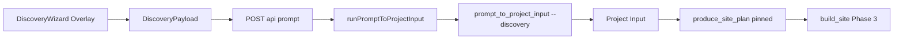

# B121 Discovery Resolver Och Taxonomy

## Scout-Baseline

Repo-läget efter handoff är `main` på `1e8abb2`, med produktcommit `0fe353f` inom bump-tolerance. Enda otrackade filen är `sammansvetsning-hela.txt`. Granskningen var read-only.

Viktig produktprincip: arbetet ska stärka kärnflödet `prompt -> företagshemsida -> preview -> följdprompt -> ny version`. Scope ska inte dra in PreviewRuntime, auth, billing, deploy, custom domains, ny stor scaffold-arkitektur eller nya Dossier-typer utanför `soft`/`hard`.

## 1. Nuvarande Faktisk Kedja

Faktiskt flöde i kod:

- `apps/viewser/components/prompt-builder.tsx` öppnar `DiscoveryWizard` i init-läge, kör `composeMasterPrompt(cleaned, answers)` som `prompt`, och skickar `buildDiscoveryPayload(cleaned, answers)` som `discovery` till `/api/prompt`.
- `apps/viewser/components/discovery-wizard/wizard-payload.ts` bygger `DiscoveryPayload` med `schemaVersion`, `rawPrompt`, `contentBranch`, `scaffoldHint` och `answers`.
- `apps/viewser/app/api/prompt/route.ts` validerar bara ytterformen med Zod. `answers` är löst (`z.record(z.string(), z.unknown())`). `followup + discovery` blockas.
- `apps/viewser/lib/prompt-runner.ts` skriver `discovery.json` till tempdir och skickar `--discovery <path>` till `scripts/prompt_to_project_input.py`.
- `scripts/prompt_to_project_input.py` kör `briefModel`/fallback, bygger Project Input, och patchar sedan med `_apply_discovery_overrides`.
- `_apply_discovery_overrides` gör fältvisa, hårdkodade overrides: wizardens company/contact/services/brand/assets vinner om ifyllt; `mustHave` mappas till `requestedCapabilities`; `scaffoldHint` får bara vara `local-service-business` eller `ecommerce-lite` och sätter även `variantId` till `nordic-trust`/`clean-store`.
- Project Input + meta skrivs till `data/prompt-inputs/<siteId>.vN.project-input.json`, `<siteId>.vN.meta.json` och current-pointers. Meta innehåller slutlig `scaffoldId`/`variantId`, men ingen sammanhållen Discovery Decision ännu.
- `scripts/build_site.py` anropar `produce_site_plan(..., pinned={scaffoldId, variantId, starterId?})`.
- `packages/generation/planning/plan.py` gör pinned path deterministiskt: validerar scaffold på disk, variant i scaffoldens `variants/*.json`, starter mot `SCAFFOLD_TO_STARTER`, och kör `filter_capabilities` mot `capability-map.v1.json`.
- Phase 3 monterar Dossiers från Project Inputs `selectedDossiers.required`; planningens rekommenderade Dossiers synkar inte automatiskt till monteringen.

## 2. Drift Och Riskpunkter

Frontend har egen sanning:

- `apps/viewser/components/discovery-wizard/wizard-constants.ts` håller `WizardCategoryId`, svenska labels, `ScaffoldHint`, `defaultVariantId` och `resolveContentBranch`.
- `ScaffoldHint` är bara `local-service-business | ecommerce-lite`, trots att `governance/policies/scaffold-contract.v1.json` listar 14 primära scaffold-id:n.
- `contentBranch` beräknas från hela kategorimängden med prioritet, medan `scaffoldHint` tas från första valda kategori. Flera val kan därför skapa motstridiga signaler.
- `defaultVariantId` finns i TS men skickas inte i `DiscoveryPayload`; Python återskapar variantval hårdkodat.

Backend har egen sanning:

- `scripts/prompt_to_project_input.py::_apply_discovery_overrides` innehåller fältmapping, capability mapping från svenska sidnamn, scaffold whitelist och variant mapping.
- `_load_discovery_file` validerar bara grundshape, inte kategoriernas semantik.
- Meta/sidecar saknar `fieldSources`, `fallbackWarnings` och ett spårbart beslut som kan svara på varför ett fält vann.

Governance har egen sanning:

- `governance/policies/scaffold-contract.v1.json` är sanningen för giltiga scaffolds och enabled-state.
- `governance/policies/starter-registry.v1.json` och `data/starters/README.md` plus `tests/test_starter_scaffold_mapping.py` låser starter-läget.
- `governance/policies/capability-map.v1.json` är sanningen för capability -> Dossier.
- `governance/schemas/project-input.schema.json` kräver `scaffoldId`, `variantId`, `requestedCapabilities` och `selectedDossiers`, men den säger inget om discovery-provenance.
- Ingen policy täcker `categoryId -> targetScaffoldId -> active/fallback scaffold -> defaultVariantId -> expectedStarterId -> capabilities -> candidateDossiers`.

LLM får tolka sådant som bör vara deterministiskt:

- Samma discovery-fakta skickas både som strukturerat `discovery.answers` och som text i `composeMasterPrompt`; `briefModel` kan tolka om företagsnamn, tjänster, kontakt, capabilities och copy.
- `requestedCapabilities` kan ändras mellan Project Input och builderns `site-brief.json` när real briefModel används i `build_site.py`.
- B121 beskriver exakt detta som fyra lager utan explicit konfliktlösare: `WizardAnswers` -> tempfil -> `briefModel` -> `_apply_discovery_overrides`.

## 3. Minimal Discovery Resolver

PR A bör skapa en liten backend/governance-resolver, inte ny UI eller stor runtime.

Nya filer:

- `packages/generation/discovery/__init__.py`
- `packages/generation/discovery/models.py`
- `packages/generation/discovery/taxonomy.py`
- `packages/generation/discovery/resolve.py`
- `governance/policies/discovery-taxonomy.v1.json`
- `governance/schemas/discovery-taxonomy.schema.json`
- `governance/schemas/discovery-payload.schema.json`
- `governance/schemas/discovery-decision.schema.json`

Input:

- raw prompt
- `DiscoveryPayload` från Viewser
- candidate Project Input från brief/site-brief
- optional scrape/upload-derived fields som redan ligger i `answers`
- loaded scaffold registry, starter registry, capability map och taxonomy

Output:

- resolved Project Input dict, fortfarande kompatibel med `project-input.schema.json`
- `DiscoveryDecision` dict som kan skrivas till prompt-input meta eller en sidecar bredvid Project Input

Minsta `DiscoveryDecision`:

- `schemaVersion`
- `categoryIds`
- `contentBranch`
- `targetScaffoldId`
- `selectedScaffoldId`
- `fallbackScaffoldId` optional
- `selectedVariantId`
- `expectedStarterId`
- `requestedCapabilities`
- `candidateDossiers`
- `fieldSources`
- `fallbackWarnings`
- `operatorReviewRequired`
- `selectionSource`, exempelvis `wizard`, `taxonomy`, `brief`, `default`

Field-source-regel:

- `wizard` vinner när fält är explicit ifyllt.
- `scrape` vinner bara när wizard saknar explicit fält.
- `brief` vinner där wizard/scrape saknar fält.
- `taxonomy` styr kategori/scaffold/variant/capability/dossier-kandidater.
- `default` används sist och ska spåras.
- `operator` eller `pinned` ska reserveras för framtida Backoffice/Project Input-pins, men inte behöva full UI i PR A.

Fält som ska spåras direkt:

- `company.name`, `company.tagline`, `company.story`
- `contact.email`, `contact.phone`, `contact.addressLines`, `location.city`
- `services`
- `brand.logo`, `brand.heroImage`, `brand.primaryColorHex`, `brand.accentColorHex`, `gallery`
- `conversionGoals`
- `requestedCapabilities`
- `scaffoldId`, `variantId`, `starterId` eller `expectedStarterId`
- `selectedDossiers` och `candidateDossiers` som separata begrepp

Refaktorregel:

- Ersätt inte hela `scripts/prompt_to_project_input.py`.
- Gör `_apply_discovery_overrides` till tunn wrapper runt `packages/generation/discovery.resolve` under en övergång.
- Bevara CLI-kontraktet `--discovery` och stdout-nycklar.
- Skriv beslutet till befintligt prompt-input meta/sidecar utan att bryta engine-run-kontraktet för de åtta run-artefakterna.

Tester för PR A:

- Taxonomy validerar mot schema.
- Alla `WizardCategoryId` från `wizard-constants.ts` finns i taxonomy.
- Okänd category blockas eller ger deterministisk fallback med warning.
- `ecommerce` ger `ecommerce-lite`, `clean-store` och expected `commerce-base`.
- `restaurant` kan ha target scaffold som restaurant/hospitality men selected/fallback `local-service-business` tills runtime-scaffold finns.
- Wizard company name vinner över brief company name och får `fieldSources.company.name = wizard`.
- Scrape email vinner bara när wizard email saknas.
- Brief-värde bevaras när wizardfält är tomt.
- `mustHave` och category mapping normaliseras till `requestedCapabilities` med source-spår.
- `fallbackWarnings` skapas för fallback/planned categories.
- `prompt_to_project_input.py --discovery` använder resolver och skriver beslut i meta/sidecar.
- Pinned planning fortsätter validera scaffold/variant/starter som idag.

## 4. Discovery-Taxonomy Policy

Policy-fält:

- `policyId`
- `version`
- `status`
- `purpose`
- `categories`
- optional `contentBranches` om branch-prioriteten flyttas från TS till policy

Category-fält:

- `id`, samma som frontendens category id
- `labelSv`
- `labelEn` optional
- `contentBranch`
- `supportStatus`: `active`, `fallback`, `planned`, `disabled`
- `targetScaffoldId`: produktens riktiga målscaffold enligt scaffold registry
- `activeScaffoldId`: buildbar scaffold idag, när fullt aktiv
- `fallbackScaffoldId`: buildbar scaffold idag, när target saknas eller är planned
- `defaultVariantId`
- `expectedStarterId`
- `requestedCapabilities`
- `candidateDossiers`
- `recommendedPages`
- `rationale`
- `operatorNotes` optional

Valideringsregler:

- Varje category id från wizarden måste finnas i `discovery-taxonomy.v1.json`.
- `targetScaffoldId` måste finnas i `primaryScaffoldRegistry`.
- `selected/active/fallback scaffold` måste finnas på disk om den används för build.
- `defaultVariantId` måste finnas under vald buildbar scaffolds variants.
- `expectedStarterId` ska matcha `SCAFFOLD_TO_STARTER` om satt.
- `requestedCapabilities` måste finnas i `capability-map.v1.json` eller ge explicit warning/gap.
- `candidateDossiers` måste finnas som soft/hard Dossier-manifest eller markeras som gap; de får inte bli `selectedDossiers.required` bara för att taxonomy föreslår dem.

Viktig modellgräns:

- Frontend skickar category, answers, assets och hints.
- Resolvern avgör selected scaffold/variant och expected starter.
- Planning är fortsatt canonical för faktisk starter-resolution och capability filtering.
- Dossier-kandidater är inte samma sak som mounted/required Dossiers.

Naming/term risk:

- Lägg till termer i `governance/policies/naming-dictionary.v1.json` om markdown/docs introducerar `Discovery Resolver`, `Discovery Taxonomy` eller `Discovery Decision` som domänbegrepp.
- Undvik onödig versal domäncopy i `.md` som kan trigga `scripts/check_term_coverage.py --strict`.

## 5. Backoffice Integration

PR C bör bygga på PR A:s policy och decision-modell, inte försöka uppfinna mappningen själv.

Visa i Kontrollplan:

- category -> target scaffold
- category -> active/fallback scaffold
- scaffold -> expected starter
- category/scaffold -> default variant
- category -> requested capabilities
- category/capability -> candidate dossiers
- support status: active/fallback/planned/disabled
- fallback warnings och operator review required
- per-run spårning: `wizardAnswers` ⇄ `brief` ⇄ `DiscoveryDecision` ⇄ `finalProjectInput`

Graph/impact:

- Lägg noder för discovery category och kanter till scaffold, variant, starter, capabilities och candidate dossiers.
- `impact.py` bör beskriva att discovery-category ändringar påverkar framtida init-runs, inte redan skrivna Project Inputs.
- Doctor bör varna när category pekar mot scaffold som saknar runtime-mapping eller default variant saknas.

Editera nu:

- `supportStatus`
- `labelSv` och `operatorNotes`
- `targetScaffoldId`
- `activeScaffoldId` eller `fallbackScaffoldId`
- `defaultVariantId`
- `requestedCapabilities`
- `candidateDossiers`

Vänta:

- Full promotion av Dossier candidates till canonical Dossiers.
- Full promotion av Variant candidates till canonical variants.
- Automatisk mount av taxonomy candidates till `selectedDossiers.required`.
- Ny scaffold-import eller nya stora scaffold-familjer.
- Per-run editor som skriver om gamla Project Inputs.

Teknisk backoffice-regel:

- Använd befintliga atomic write-mönster från `backoffice/io.py` eller motsvarande validering/rollback.
- Själva `Kontrollplan` är idag read-only i `backoffice/views/building_blocks.py`; låt första PR C gärna vara review-yta + begränsad policy-edit, inte ett stort adminsystem.

## 6. PR-Slicing

PR A: backend/governance resolver

- Lägg taxonomy-policy och schemas.
- Lägg `packages/generation/discovery` med resolver, models och taxonomy-loader.
- Koppla `scripts/prompt_to_project_input.py --discovery` till resolvern via tunn wrapper.
- Skriv `DiscoveryDecision` i prompt-input meta/sidecar.
- Lägg tests för category coverage, fieldSources, fallbackWarnings, Project Input schema och pinned planning.
- Lägg naming-dictionary-termer vid behov.

PR B: frontend alignment

- Antingen läser Viewser UI-safe discovery-options från backend/governance, eller så låses `wizard-constants.ts` med test mot `discovery-taxonomy.v1.json`.
- Frontend får fortsätta skicka category/answers/hints, men inte vara ensam sanning för category->scaffold/variant.
- Frontend ska inte sätta starter.
- Visa fallback/planned-status försiktigt om category inte är runtime-aktiv.
- Testa att followup fortsatt inte skickar discovery.

PR C: backoffice discovery control

- Lägg discovery mapping i Kontrollplan eller ny Building Blocks-vy.
- Lägg graph/impact/Doctor-stöd för category -> scaffold/variant/starter/capability/dossier-kandidater.
- Lägg begränsad edit med validering mot scaffold contract, variants, starter mapping och capability map.
- Lägg dry-run panel som kör resolver och visar `DiscoveryDecision`, `fieldSources`, `fallbackWarnings` utan att skriva Project Inputs om inte operatorn explicit exporterar sample.

PR D: verifiering/smoke/eval

- Kör fyra produktbaseline-case med init discovery: elektriker Malmö, frisör Göteborg, naprapatklinik Stockholm, liten e-handel som säljer keramik.
- Verifiera `prompt_to_project_input.py --discovery`, `build_site.py`, generated preview-output, `site-plan.json`, `generation-package.json`, `DiscoveryDecision`, fieldSources och fallbackWarnings.
- Lägg regression/smoke som säkrar att B121 kan stängas.
- Kör fulla guards enligt repo-standard: `python -m ruff check .`, `python scripts/governance_validate.py`, `python scripts/rules_sync.py --check`, `python scripts/check_term_coverage.py --strict`, `python -m pytest tests/` och Viewser lint/build när frontend ändras.

## 7. Riskklassning

Blocker:

- Ingen canonical taxonomy finns idag för category -> scaffold/variant/starter/capability/dossier.
- `_apply_discovery_overrides` löser konflikter implicit genom sista-vinner utan fieldSources.
- Frontend och Python duplicerar variant/scaffold-sanning.
- Backoffice kan inte förklara varför ett discovery-fält vann.

Medium risk:

- Multi-select category kan ge olika `contentBranch` och `scaffoldHint`.
- Real `briefModel` kan ändra/utelämna `requestedCapabilities` trots Project Input-hints.
- Planning rekommenderar Dossiers men Phase 3 monterar bara `selectedDossiers.required` från Project Input.
- `merge_operator_selected_with_helper` behåller operator-dict och kan tappa helperns recommended-lista när operator-dict är tomma auto-listor.
- Term coverage/naming kan fallera om nya domäntermer inte registreras.

Nice-to-have:

- Generera TS category constants från taxonomy i stället för manuell spegling.
- Backoffice dry-run med sample answers per category.
- Mer detaljerad per-run diffvy för `wizardAnswers` mot final Project Input.
- Maxstorlek/hårdare schema för discovery payload i `apps/viewser/app/api/prompt/route.ts`.

Out-of-scope:

- Ny PreviewRuntime.
- Auth, billing, deploy, custom domains.
- Full StackBlitz/Fly-arkitektur.
- Nya stora scaffolds.
- Nya Dossier-typer utanför `soft` och `hard`.
- Full promotion-system för variant/dossier candidates.
- Automatisk rewriting av gamla Project Inputs.

