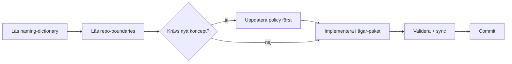

# Agent-handbok

Det här är vad varje AI-agent (eller mänsklig medhjälpare) behöver veta innan de börjar arbeta i Sajtbyggaren.

## Läs i denna ordning

0. [`docs/current-focus.md`](current-focus.md) - aktuell köplan. Läs alltid först.
1. [`docs/agent-prompts.md`](agent-prompts.md) - fasta agentroller och copy-paste-startprompter.
2. [`docs/PROJECT_BRIEF.md`](PROJECT_BRIEF.md) - vad och varför.
3. [`docs/architecture/system-overview.md`](architecture/system-overview.md) - hur lagren hänger ihop.
4. [`docs/glossary.md`](glossary.md) - mänsklig genomgång av alla begrepp.
5. [`governance/policies/naming-dictionary.v1.json`](../governance/policies/naming-dictionary.v1.json) - kanoniska termer (sanningskälla).
6. [`governance/policies/repo-boundaries.v1.json`](../governance/policies/repo-boundaries.v1.json) - mappägarskap.
7. [`governance/policies/engine-run.v1.json`](../governance/policies/engine-run.v1.json) - artefaktkontraktet för en körning.
8. [`docs/architecture/llm-flow.md`](architecture/llm-flow.md) - fas 1-3.
9. [`governance/decisions/0009-engine-run-and-llm-models.md`](../governance/decisions/0009-engine-run-and-llm-models.md) - varför Engine Run-modellen ser ut så.
10. [`docs/migration-plan.md`](migration-plan.md) - sprint-ordning och vad som plockats varifrån.

## Hårda regler för agentarbete

- **Governance först.** Ett koncept som rör flera mappar måste finnas i en policy under `governance/policies/` innan det får finnas i kod.
- **Inga synonymer.** Använd exakt det kanoniska namnet i `naming-dictionary.v1.json`. Lägg inte till alias som inte står i `aliasesAllowed`.
- **Mappgränser respekteras.** Importgränserna i `repo-boundaries.v1.json` blockerar review.
- **`.cursor/rules` är speglar.** Redigera aldrig direkt; ändra under `governance/rules/` och kör `python scripts/rules_sync.py`.
- **Validera policies före commit.** `python scripts/governance_validate.py` ska returnera exit-kod 0.
- **Svenska först.** Svara alltid på svenska, även när användaren skriver engelska. Använd riktiga `å`, `ä`, `ö`. Aldrig `\u00f6` eller ASCII-translit.

## Arbetsflöde för en typisk uppgift

## Vanliga fallgropar

- **Skapa en ny term i koden utan att uppdatera policy.** Görs - men då måste policy uppdateras i samma PR.
- **Kalla något `template`, `starter`, `boilerplate` istället för `Scaffold`.** Använd kanoniskt namn.
- **Återinföra tier-uppdelning för quality gate.** Termerna står i `naming-dictionary.v1.json:globallyForbidden`. EN gate eller ny policy-version.
- **Skriva runtime-logik i `backend.py`.** Backoffice är admin, inte runtime.
- **Lägga LLM-anrop i fel fas.** Kontrollera `allowedToCallLLM` i `llm-flow-concepts.v1.json`.

## När du fastnar

- Kolla först om det finns en relevant ADR i [`governance/decisions/`](../governance/decisions/).
- Kolla om termen står i `naming-dictionary.v1.json` med en annan betydelse än du tror.
- Föreslå en policy-uppdatering hellre än att hitta en kreativ workaround i kod.

## Reviewer-checklist (cloud-reviewer eller extern review-runda)

Kort lista över det som oftast missas av agenten men fångas av en reviewer-runda i den här koden:

1. Verifiera varje claim mot källan, inte mot commit-meddelandet. Läs koden för varje "stängd B-ID" innan stämpling.
2. Race conditions kommer i kluster. En ny `useEffect` med `await` ska ha cancelled-guard på success-, error- och cleanup-vägen; saknad guard på en gren är vanligaste regressionvägen (se B42/B43 i `docs/known-issues.md`).
3. Source-lock-tester ska låsa beteende, inte syntax. Tighta regex för exakta strängar bryts av harmlösa refactor-er; lås egenskaper ("får inte förekomma X i felgrenen") istället för exakta literaler.
4. Verifiera de fyra guards lokalt eftersom standardflödet går direkt på
   `main`:
   - `python scripts/governance_validate.py`
   - `python scripts/rules_sync.py --check`
   - `python scripts/check_term_coverage.py --strict`
   - `python -m pytest tests/ -q`
5. Verifiera scope. En sprint som rör fil X ska deklarera X i sin scope-rad.
   Scope-läckage är värt en blocker, inte ett godkännande med kommentar.
6. Naming-dictionary. Nya canonical termer kräver ADR. Lokala TS/Python-symboler bor i `scripts/check_term_coverage.py:COMMON_WORDS`.
7. Backup-disciplin. Inför varje ny sprint ska en ny `backup-N` skapas från
   synkad `main`; backupen är fallback, inte arbetsbranch.

## Fasta agentroller

Projektet använder tre fasta agentroller:

- **Scout-agent** - read-only. Läser, utreder, hittar risker och fungerar som
  RO-bugggranskare före push när sprinten går direkt på `main`. Lämnar
  rekommendation eller Builder-prompt. Gör inga filändringar, commits eller
  pushar.
- **Builder-agent** - implementation. Skapar sprintens `backup-N`, jobbar
  vidare på `main`, implementerar, testar och rapporterar innan push om
  ändringen är stor eller riskabel.
- **Steward-agent** - ordning och sanity. Jobbar på `main` med låg-risk
  docs/governance/fokusuppdateringar, kör sanity och håller
  `docs/current-focus.md` färsk.

Operatören beslutar riktning och godkänner risk. Extern GPT-reviewer kan ge
beslutsstöd men ändrar inte repo. Bugbot är inte en egen agentroll i
standardflödet; den används bara om operatören uttryckligen väljer PR-flöde.
Färdiga startprompter för rollerna finns i
[`docs/agent-prompts.md`](agent-prompts.md).

## Parallella agenter

När flera agenter jobbar samtidigt gäller rollfördelningen i
[`governance/rules/branch-discipline.md`](../governance/rules/branch-discipline.md)
under rubriken "Parallella agenter". Sammanfattning:

- Steward-agent får inte röra filer som ligger i scope för en pågående
  Builder-sprint.
- Builder-agent äger sina scope-filer tills sprinten är klar.
- Aktiva spår (B-IDs eller sprintar) listas i `docs/known-issues.md` eller
  `docs/current-focus.md`. De filerna är off-limits för annat arbete tills
  Builder-agenten är klar.

## Standard loop

Varje etapp följer samma korta loop. Syftet är att
varje delsteg har en tydlig ägare och en tydlig avlämningsyta.

0. **Drift-check.** Första kommando i varje ny agentsession är `python scripts/focus_check.py`. Det jämför HEAD mot "Last verified"-SHA:n i [`docs/current-focus.md`](current-focus.md) och varnar om glömd push, glömd pull eller stalad focus-fil. Lös varningar innan något annat startas.
1. **Scout vid behov.** Om uppdraget är stort eller oklart gör Scout-agenten
   read-only-audit och lämnar rekommenderad Builder-prompt.
2. **Sprint-backup.** Builder- eller Steward-agenten skapar nästa `backup-N`
   från synkad `main` och stannar sedan kvar på `main`.
3. **Implementation på main.** Builder-agenten genomför en avgränsad uppgift
   direkt på `main`. Steward-agenten gör bara låg-risk docs/governance/sanity.
4. **RO-review.** Scout-agenten granskar diffen read-only före push och
   klassar fynd som blocker, risk, nice-to-have eller falskt fynd. Vid
   PR-undantag kan Bugbot användas, men PR är inte standardflödet. Inför en
   ny större sprint ska Scout också föreslå modell-/insatsnivå 1-10 för nästa
   agentpass. Om Scout säger att push är OK och working tree är clean får
   Builder pusha direkt utan ny manuell operatörs-OK.
5. **Operatör + extern reviewer** beslutar: fortsätt, fixa eller skrota när
   Scout inte redan har gett tydlig push-OK eller när risken kräver det.
6. **Final sanity** kör `python scripts/review_check.py` (samma kedja som pre-push-guards).
7. **Commit + push till main** efter gröna guards och godkänd riktning. När
   Builder har pushat klart skickas Builder-resultatet till Steward för
   post-push-verifiering.
8. **Steward verifierar post-push och uppdaterar [`docs/current-focus.md`](current-focus.md) / [`docs/handoff.md`](handoff.md) vid behov.** Rapportera alltid: pushed SHA, `git status`, `python scripts/focus_check.py`, om `origin/main` matchar lokal `main`, samt om docs uppdaterades och varför. Uppdatera docs när ny faktisk HEAD avslutar en sprint, active sprint ändras, next action/queue/blocked ändras, agentflöde/branchflöde/Grindmode/rollansvar ändras, ny risk/blocker/nice-to-have blir viktig för nästa agent, eller extern PR/Grind-agent ändrar vad `main` betyder. Hoppa över docs för ren mikrostatus som inte ändrar nästa agents arbete.
9. **Nästa etapp** plockas från queue-listan i `docs/current-focus.md`. Builder-agenten ska i slutrapporten ge en grov progressbedömning i procent för sprinten och nästa etapp.

Om operatören uttryckligen väljer PR-flöde används pull request-mallen i
[`.github/pull_request_template.md`](../.github/pull_request_template.md).
