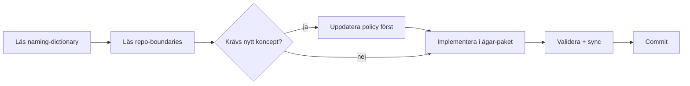

# Agent-handbok

Det här är vad varje AI-agent (eller mänsklig medhjälpare) behöver veta innan de börjar arbeta i Sajtbyggaren.

## Läs i denna ordning

1. [`docs/PROJECT_BRIEF.md`](PROJECT_BRIEF.md) - vad och varför.
2. [`docs/architecture/system-overview.md`](architecture/system-overview.md) - hur lagren hänger ihop.
3. [`docs/glossary.md`](glossary.md) - mänsklig genomgång av alla begrepp.
4. [`governance/policies/naming-dictionary.v1.json`](../governance/policies/naming-dictionary.v1.json) - kanoniska termer (sanningskälla).
5. [`governance/policies/repo-boundaries.v1.json`](../governance/policies/repo-boundaries.v1.json) - mappägarskap.
6. [`governance/policies/engine-run.v1.json`](../governance/policies/engine-run.v1.json) - artefaktkontraktet för en körning.
7. [`docs/architecture/llm-flow.md`](architecture/llm-flow.md) - fas 1-3.
8. [`governance/decisions/0009-engine-run-and-llm-models.md`](../governance/decisions/0009-engine-run-and-llm-models.md) - varför Engine Run-modellen ser ut så.
9. [`docs/migration-plan.md`](migration-plan.md) - sprint-ordning och vad som plockats varifrån.

## Hårda regler för agentarbete

- **Governance först.** Ett koncept som rör flera mappar måste finnas i en policy under `governance/policies/` innan det får finnas i kod.
- **Inga synonymer.** Använd exakt det kanoniska namnet i `naming-dictionary.v1.json`. Lägg inte till alias som inte står i `aliasesAllowed`.
- **Mappgränser respekteras.** Importgränserna i `repo-boundaries.v1.json` blockerar review.
- **`.cursor/rules` är speglar.** Redigera aldrig direkt; ändra under `governance/rules/` och kör `python scripts/rules_sync.py`.
- **Validera policies före commit.** `python scripts/governance_validate.py` ska returnera exit-kod 0.
- **Svenska först.** Svara alltid på svenska, även när användaren skriver engelska. Använd riktiga `å`, `ä`, `ö`. Aldrig `\u00f6` eller ASCII-translit.

## Arbetsflöde för en typisk uppgift

## Vanliga fallgropar

- **Skapa en ny term i koden utan att uppdatera policy.** Görs - men då måste policy uppdateras i samma PR.
- **Kalla något `template`, `starter`, `boilerplate` istället för `Scaffold`.** Använd kanoniskt namn.
- **Återinföra tier-uppdelning för quality gate.** Termerna står i `naming-dictionary.v1.json:globallyForbidden`. EN gate eller ny policy-version.
- **Skriva runtime-logik i `backend.py`.** Backoffice är admin, inte runtime.
- **Lägga LLM-anrop i fel fas.** Kontrollera `allowedToCallLLM` i `llm-flow-concepts.v1.json`.

## När du fastnar

- Kolla först om det finns en relevant ADR i [`governance/decisions/`](../governance/decisions/).
- Kolla om termen står i `naming-dictionary.v1.json` med en annan betydelse än du tror.
- Föreslå en policy-uppdatering hellre än att hitta en kreativ workaround i kod.

## Reviewer-checklist (cloud-reviewer eller extern review-runda)

Kort lista över det som oftast missas av agenten men fångas av en reviewer-runda i den här koden:

1. Verifiera varje claim mot källan, inte mot commit-meddelandet. Läs koden för varje "stängd B-ID" innan stämpling.
2. Race conditions kommer i kluster. En ny `useEffect` med `await` ska ha cancelled-guard på success-, error- och cleanup-vägen; saknad guard på en gren är vanligaste regressionvägen (se B42/B43 i `docs/known-issues.md`).
3. Source-lock-tester ska låsa beteende, inte syntax. Tighta regex för exakta strängar bryts av harmlösa refactor-er; lås egenskaper ("får inte förekomma X i felgrenen") istället för exakta literaler.
4. Verifiera de fyra guards lokalt om PR saknar CI:
   - `python scripts/governance_validate.py`
   - `python scripts/rules_sync.py --check`
   - `python scripts/check_term_coverage.py --strict`
   - `python -m pytest tests/ -q`
5. Verifiera scope. En PR som rör fil X ska deklarera X i sin scope-rad. Scope-läckage är värt en blocker, inte ett godkännande med kommentar.
6. Naming-dictionary. Nya canonical termer kräver ADR. Lokala TS/Python-symboler bor i `scripts/check_term_coverage.py:COMMON_WORDS`.
7. Branch cleanup efter merge. Både lokal och remote branch ska raderas. `git branch -a` ska bara visa `main` plus backupper när inget pågår.

## Parallella agenter

När flera agenter jobbar samtidigt (typiskt: lokal mainline-steward på `main` plus en cloud-/feature-agent på egen branch) gäller den rollfördelning som beskrivs i [`governance/rules/branch-discipline.md`](../governance/rules/branch-discipline.md) under rubriken "Parallella agenter". Sammanfattning:

- Mainline-steward gör docs/governance/checklist/cleanup på `main`. Får inte röra filer som ligger i scope för en pågående feature-agent.
- Feature-agent jobbar på egen branch, pushar bara till den branchen, och mergar via operatör eller PR.
- Aktiva spår (B-IDs eller sprintar) listas i `docs/known-issues.md`. De filer ett aktivt spår räknar upp som scope är off-limits för mainline-arbete tills feature-agenten är klar.
