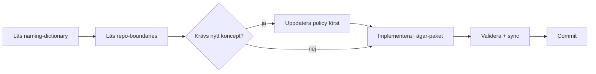

# Agent-handbok

Det här är vad varje AI-agent (eller mänsklig medhjälpare) behöver veta innan de börjar arbeta i Sajtbyggaren.

## Läs i denna ordning

0. [`docs/current-focus.md`](current-focus.md) - aktuell köplan. Läs alltid först.
1. [`docs/product-operating-context.md`](product-operating-context.md) - produktkompass och prioriteringsfilter.
2. [`docs/orchestrator-playbook.md`](orchestrator-playbook.md) - läs vid längre fleragentpass; orkestratorn är arbetssätt, inte fjärde fast roll.
3. [`docs/agent-prompts.md`](agent-prompts.md) - fasta agentroller och copy-paste-startprompter.
4. [`docs/PROJECT_BRIEF.md`](PROJECT_BRIEF.md) - vad och varför.
5. [`docs/architecture/system-overview.md`](architecture/system-overview.md) - hur lagren hänger ihop.
6. [`docs/glossary.md`](glossary.md) - mänsklig genomgång av alla begrepp.
7. [`governance/policies/naming-dictionary.v1.json`](../governance/policies/naming-dictionary.v1.json) - kanoniska termer (sanningskälla).
8. [`governance/policies/repo-boundaries.v1.json`](../governance/policies/repo-boundaries.v1.json) - mappägarskap.
9. [`governance/policies/engine-run.v1.json`](../governance/policies/engine-run.v1.json) - artefaktkontraktet för en körning.
10. [`docs/architecture/llm-flow.md`](architecture/llm-flow.md) - fas 1-3.
11. [`governance/decisions/0009-engine-run-and-llm-models.md`](../governance/decisions/0009-engine-run-and-llm-models.md) - varför Engine Run-modellen ser ut så.
12. [`docs/migration-plan.md`](migration-plan.md) - sprint-ordning och vad som plockats varifrån.

## Hårda regler för agentarbete

- **Governance först.** Ett koncept som rör flera mappar måste finnas i en policy under `governance/policies/` innan det får finnas i kod.
- **Inga synonymer.** Använd exakt det kanoniska namnet i `naming-dictionary.v1.json`. Lägg inte till alias som inte står i `aliasesAllowed`.
- **Mappgränser respekteras.** Importgränserna i `repo-boundaries.v1.json` blockerar review.
- **`.cursor/rules` är speglar.** Redigera aldrig direkt; ändra under `governance/rules/` och kör `python scripts/rules_sync.py`.
- **Validera policies före commit.** `python scripts/governance_validate.py` ska returnera exit-kod 0.
- **Svenska först.** Svara alltid på svenska, även när användaren skriver engelska. Använd riktiga `å`, `ä`, `ö`. Aldrig `\u00f6` eller ASCII-translit.
- **Produktkompassen först vid tradeoffs.** Om en ändring inte hjälper
  `prompt -> företagshemsida -> preview -> följdprompt -> ny version`
  ska den parkeras om operatören inte uttryckligen prioriterar den.

## Arbetsflöde för en typisk uppgift



## Vanliga fallgropar

- **Skapa en ny term i koden utan att uppdatera policy.** Görs - men då måste policy uppdateras i samma PR.
- **Kalla något `template`, `starter`, `boilerplate` istället för `Scaffold`.** Använd kanoniskt namn.
- **Återinföra tier-uppdelning för quality gate.** Termerna står i `naming-dictionary.v1.json:globallyForbidden`. EN gate eller ny policy-version.
- **Skriva runtime-logik i `backoffice.py`.** Backoffice är admin, inte runtime.
- **Lägga LLM-anrop i fel fas.** Kontrollera `allowedToCallLLM` i `llm-flow-concepts.v1.json`.

## När du fastnar

- Kolla först om det finns en relevant ADR i [`governance/decisions/`](../governance/decisions/).
- Kolla om termen står i `naming-dictionary.v1.json` med en annan betydelse än du tror.
- Föreslå en policy-uppdatering hellre än att hitta en kreativ workaround i kod.

## Reviewer-checklist (cloud-reviewer eller extern review-runda)

Kort lista över det som oftast missas av agenten men fångas av en reviewer-runda i den här koden:

1. Verifiera varje claim mot källan, inte mot commit-meddelandet. Läs koden för varje "stängd B-ID" innan stämpling.
2. Race conditions kommer i kluster. En ny `useEffect` med `await` ska ha cancelled-guard på success-, error- och cleanup-vägen; saknad guard på en gren är vanligaste regressionvägen (se B42/B43 i `docs/known-issues.md`).
3. Source-lock-tester ska låsa beteende, inte syntax. Tighta regex för exakta strängar bryts av harmlösa refactor-er; lås egenskaper ("får inte förekomma X i felgrenen") istället för exakta literaler.
4. Verifiera de fyra guards lokalt före push:
   - `python scripts/governance_validate.py`
   - `python scripts/rules_sync.py --check`
   - `python scripts/check_term_coverage.py --strict`
   - riktade pytest-sviter för ändrade filer/paket (lokal default,
     operatörsbeslut 2026-06-11); full svit kör CI på PR:en. Full svit
     lokalt bara vid breda ändringar: `python -m pytest tests/ -q -n auto`
     (pytest-xdist, se `docs/testing.md`)
5. Verifiera scope. En sprint som rör fil X ska deklarera X i sin scope-rad.
   Scope-läckage är värt en blocker, inte ett godkännande med kommentar.
6. Naming-dictionary. Nya canonical termer kräver ADR. Lokala TS/Python-symboler bor i `scripts/check_term_coverage.py:COMMON_WORDS`.
7. Branch-disciplin. Verifiera att arbetet ligger på rätt arbets-branch
   (`jakob-be` för Jakob, `christopher` för Christopher) och att inga
   off-limits-paths är rörda (se `governance/rules/branch-scope-ui-ux.md`).

## Fasta agentroller

Projektet använder tre fasta agentroller:

- **Scout-agent** - read-only. Läser, utreder, hittar risker och fungerar
  som RO-bugggranskare före push på en arbets-branch (`jakob-be` eller
  `christopher`) eller före PR mot `main`. Lämnar rekommendation eller
  Builder-prompt. Gör inga filändringar, commits eller pushar.
- **Builder-agent** - implementation. Jobbar på sin arbets-branch
  (`jakob-be` för Jakob, `christopher` för Christopher), implementerar,
  testar och rapporterar innan push om ändringen är stor eller riskabel.
- **Steward-agent** - ordning och sanity. Jobbar primärt på arbets-branchen
  för docs som hör till pågående arbete; kan göra direkt-push till `main`
  för pure docs/governance-bumpar enligt
  [`governance/rules/04-branch-and-team.md`](../governance/rules/04-branch-and-team.md).
  Håller `docs/current-focus.md` och `docs/handoff.md` färska.

Operatören beslutar riktning och godkänner risk. Extern GPT-reviewer kan ge
beslutsstöd men ändrar inte repo. Bugbot är default på när PR mot `main`
öppnas; den är inte aktiv på arbets-branchens push:ar. Färdiga
startprompter för rollerna finns i
[`docs/agent-prompts.md`](agent-prompts.md).

## Parallella agenter

När flera agenter jobbar samtidigt gäller rollfördelningen i
[`governance/rules/04-branch-and-team.md`](../governance/rules/04-branch-and-team.md)
under rubriken "Parallella agenter". Sammanfattning:

- Jakob-agent jobbar på `jakob-be`, Christopher-agent på `christopher`.
  Brancherna är solo-ägda; ingen rör motpartens branch.
- Steward-agent får inte röra filer som ligger i scope för en pågående
  Builder-sprint.
- Builder-agent äger sina scope-filer tills sprinten är klar.
- Aktiva spår (B-IDs eller sprintar) listas i `docs/known-issues.md` eller
  `docs/current-focus.md`. De filerna är off-limits för annat arbete tills
  Builder-agenten är klar.

## Standard loop

Varje etapp följer samma korta loop. Syftet är att
varje delsteg har en tydlig ägare och en tydlig avlämningsyta.

0. **Drift-check.** Första kommando i varje ny agentsession är `python scripts/focus_check.py`. Det jämför HEAD mot "Last verified"-SHA:n i [`docs/current-focus.md`](current-focus.md) och varnar om glömd push, glömd pull eller stalad focus-fil. Lös varningar innan något annat startas.
1. **Scout vid behov.** Om uppdraget är stort eller oklart gör Scout-agenten
   read-only-audit och lämnar rekommenderad Builder-prompt.
2. **Synka arbets-branchen.** Builder- eller Steward-agenten verifierar
   att aktuell branch är `jakob-be` (Jakob) eller `christopher`
   (Christopher) och att den är synkad med sin egen origin. Backup-branch
   skapas bara om operatören uttryckligen ber om det — `jakob-be`/
   `christopher` är själva permanenta säkerhetsnät.
3. **Implementation på arbets-branchen.** Builder-agenten genomför en
   avgränsad uppgift direkt på `jakob-be` eller `christopher`. Steward-
   agenten gör bara låg-risk docs/governance/sanity.
4. **RO-review.** Scout-agenten granskar diffen read-only före push och
   klassar fynd som blocker, risk, nice-to-have eller falskt fynd. Inför
   en ny större sprint ska Scout också föreslå modell-/insatsnivå 1-10
   för nästa agentpass. Om Scout säger att push är OK och working tree är
   clean får Builder pusha direkt utan ny manuell operatörs-OK.
5. **Operatör + extern reviewer** beslutar: fortsätt, fixa eller skrota
   när Scout inte redan har gett tydlig push-OK eller när risken kräver
   det.
6. **Final sanity** kör `python scripts/review_check.py` (samma kedja som
   pre-push-guards).
7. **Commit + push till arbets-branchen** efter gröna guards och godkänd
   riktning. När Builder har pushat klart skickas Builder-resultatet till
   Steward för post-push-verifiering.
8. **Steward verifierar post-push och uppdaterar [`docs/current-focus.md`](current-focus.md) / [`docs/handoff.md`](handoff.md) vid behov.** Rapportera alltid: pushed SHA, `git status`, `python scripts/focus_check.py`, om `origin/<branch>` matchar lokal `<branch>`, samt om docs uppdaterades och varför. Uppdatera docs när ny faktisk HEAD avslutar en sprint, active sprint ändras, next action/queue/blocked ändras, agentflöde/branchflöde/rollansvar ändras, ny risk/blocker/nice-to-have blir viktig för nästa agent, eller extern PR/Grind-agent ändrar vad `main` betyder. Hoppa över docs för ren mikrostatus som inte ändrar nästa agents arbete.
9. **Nästa etapp** plockas från queue-listan i `docs/current-focus.md`. Builder-agenten ska i slutrapporten ge en grov progressbedömning i procent för sprinten och nästa etapp.

PR mot `main` öppnas när en sprint eller fas är klar och ska bli en
officiell version — då används pull request-mallen i
[`.github/pull_request_template.md`](../.github/pull_request_template.md).
Bugbot körs på PR:n. Efter merge: post-merge-sync enligt
[`governance/rules/04-branch-and-team.md`](../governance/rules/04-branch-and-team.md).

## Post-build-verifiering utan preview

`scripts/verify_run.py` är ett stand-alone verktyg som läser en runs
artefakter (`data/runs/<runId>/`, sidecar-meta, generated output) och
rapporterar grön/röd per check för LLM contract propagation (B137 tagline-
läckage, B138 pageCount-trim, Intent Guard, route-konsistens, B107
service-fallback, m.fl.). Använd det när StackBlitz/preview inte är
tillgänglig eller när du vill verifiera kedjan utan att starta dev-server.

Snabbstart från repo-rot:

```powershell
python scripts/verify_run.py --site-id <siteId>          # text-output
python scripts/verify_run.py --latest --json             # JSON för agenter
python scripts/verify_run.py --site-id <siteId> --checks b137,b138
```

Full guide + agent-integrationsdiscipline + mini-eval-flöde finns i
[`docs/tools/verify_run.md`](tools/verify_run.md). Skriptet är read-only,
har inga externa dependencies och kan köras parallellt med Builder, Scout,
Steward eller cloud-grind utan låsningsrisk.
