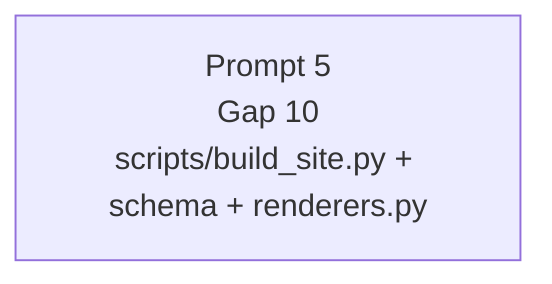

# Cloud-grind-promptar — kvarvarande backend-gap

Den här mappen innehåller **fristående copy-paste-promptar** för Cursor Cloud Agents (eller motsvarande cloud-agent som har repo-write-access via GitHub). Varje cloud-agent klonar repot från `github.com/Jakeminator123/sajtbyggaren`, jobbar i sin Ubuntu-VM, pushar till `origin/jakob-be` och slutar. **Operatörens lokala maskin är inte i loopen alls** — det enda touchground är GitHub-remoten.

Operatören öppnar ett nytt cloud-agent-fönster, klistrar in en av prompterna som första meddelande, och låter agenten köra till push.

Varje prompt-fil är self-contained: agenten ska inte behöva läsa något annat docs/-material för att kunna jobba. Den deklarerar branch, scope, off-limits, acceptanskriterier, tester och commit-format — alla kommandon är bash/Linux (cloud-VM:n är Ubuntu, ingen venv-aktivering krävs eftersom systempython + `pip install -r requirements.txt` förutsätts redan ha körts som setup-steg).

## Läget nu

Prompterna 1-4 är körda och bortstädade ur denna mapp:

- Prompt 1 stängde Gap 6 + 7 i `c002aec` + `ea6e141`.
- Prompt 2 stängde B147 i `b3834b3`.
- Prompt 3 körde docs/workboard-sync i `cb07dbb` och efterföljande steward-commits.
- Prompt 4 stängde Gap 9 i `365c1d7`.

Kvarvarande prompt är Prompt 5 (Gap 10). Den kan starta när agentens checkout har fast-forwardat till `origin/jakob-be` `365c1d7` eller senare.

## Prompt-katalog

| # | Fil | Roll | Branch | Effort | Risk | Lane |
|---|---|---|---|---|---|---|
| 5 | [`prompt-5-gap-10-product-image.md`](prompt-5-gap-10-product-image.md) | Builder | `jakob-be` | ~4-6h, M-L | Medel-Hög | Backend payload + schema + renderer |

## Parallellitet-matris



**Vad detta betyder:**

- Prompt 5 rör schema, `build_site.py` och renderers. Den är sista prompten i gap-batchen.
- Starta Prompt 5 först efter `git pull --ff-only origin jakob-be` visar `365c1d7` eller senare.

## Operatörens trigger-ordning (rekommenderad)

```
T0  (nu)         Start Prompt 5.
T+~4-6h          Alla fem klara. Sync-PR-fönster: gör nu (jakob-be → main).
```

Varje prompt går att stoppa när som helst — de är atomiska.

## Sync-PR-fönster

`jakob-be` är just nu över 30 commits framför `origin/main`. Bra läge för sync-PR är **efter Prompt 5** så hela gap-batchen + B147 + doc-städet bilar in i samma officiella main-merge.

Alternativt: öppna sync-PR före Prompt 5 och sedan en till efter Prompt 5. Det är operatörens val.

## Övergripande disciplin

Varje prompt slutar med samma rapport-rad:

```
Pushed <SHA> till origin/jakob-be. Guards alla gröna: ruff 0,
governance 18/18, rules_sync OK, term-coverage --strict OK,
sprintvakt OK, pytest grön. Klar — vänta operatörens nästa instruktion.
```

Cloud-agenten **öppnar ingen PR** själv — sync-PR `jakob-be -> main` är operatörens beslut.

Cloud-agenten **rör inte** `apps/viewser/components/**`, `apps/viewser/app/**/*.tsx`, `apps/viewser/public/**` om inte prompten uttryckligen säger det (Christopher-lane).

## Cloud-VM-förutsättningar

Innan en agent börjar, ska VM:n ha:

- Repot klonat till en arbets-katalog och `git switch jakob-be` körts.
- `pip install -r requirements.txt` körd (för python-guards + ev. nya deps som promptarna lägger till).
- `cd apps/viewser && npm install` körd (för UI-typecheck/lint i Prompt 2 och Prompt 5).
- `git config user.name` + `git config user.email` satta så commits får rätt author.
- GitHub-push-token (Personal Access Token eller GitHub App-installation) konfigurerad så `git push origin jakob-be` lyckas.

Om något av detta saknas: cloud-agenten ska stoppa direkt med felmeddelande till operatören istället för att försöka workaround-fixa.
