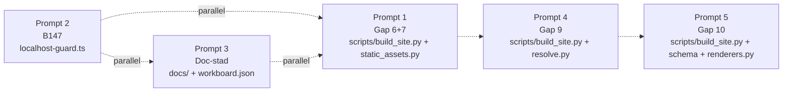

# Cloud-grind-promptar — gaps + B147 + doc-städ

Den här mappen innehåller **fristående copy-paste-promptar** för Cursor Cloud Agents (eller motsvarande cloud-agent som har repo-write-access via GitHub). Varje cloud-agent klonar repot från `github.com/Jakeminator123/sajtbyggaren`, jobbar i sin Ubuntu-VM, pushar till `origin/jakob-be` och slutar. **Operatörens lokala maskin är inte i loopen alls** — det enda touchground är GitHub-remoten.

Operatören öppnar ett nytt cloud-agent-fönster, klistrar in en av prompterna som första meddelande, och låter agenten köra till push.

Varje prompt-fil är self-contained: agenten ska inte behöva läsa något annat docs/-material för att kunna jobba. Den deklarerar branch, scope, off-limits, acceptanskriterier, tester och commit-format — alla kommandon är bash/Linux (cloud-VM:n är Ubuntu, ingen venv-aktivering krävs eftersom systempython + `pip install -r requirements.txt` förutsätts redan ha körts som setup-steg).

## Bakgrund

Sanity-check 2026-05-26 sen kväll visade att doc-läget och kod-läget hade drift på fyra punkter:

- Backend-Gap 6+7 är **delvis** (metadata renderas, men ingen .ico-konvertering eller 1200×630-crop).
- Backend-Gap 9 är **inte alls** implementerad i backend.
- Backend-Gap 10 är **inte alls** implementerad i backend.
- B147 är **inte fixat i koden** — bara `VIEWSER_ALLOW_NON_LOCALHOST`-env-bypass finns.
- Workboard/handoff/current-focus säger ibland motstridiga saker om aktiva gaps.

Inget av gapen är en blocker för kärnflödet `prompt → företagshemsida → preview → följdprompt → ny version`, men de är värda att stänga eftersom de är kosmetisk/SEO-finish (Gap 6+7), datahygien (Gap 9), e-handel-funktion (Gap 10), produktionssäkerhet (B147) och agent-disciplin (doc-städ).

## Prompt-katalog

| # | Fil | Roll | Branch | Effort | Risk | Lane |
|---|---|---|---|---|---|---|
| 1 | [`prompt-1-gap-67-paired.md`](prompt-1-gap-67-paired.md) | Builder | `jakob-be` | ~3-4h, M | Medel (ny dep `pillow`) | Backend build-pipeline |
| 2 | [`prompt-2-b147-host-whitelist.md`](prompt-2-b147-host-whitelist.md) | Builder | `jakob-be` | ~1-2h, S | Låg | UI lib + env |
| 3 | [`prompt-3-doc-workboard-cleanup.md`](prompt-3-doc-workboard-cleanup.md) | Steward | `jakob-be` | ~1h, S | Låg | Docs-only |
| 4 | [`prompt-4-gap-9-mood-isolation.md`](prompt-4-gap-9-mood-isolation.md) | Builder | `jakob-be` | ~2h, S-M | Medel | Backend asset-pipeline |
| 5 | [`prompt-5-gap-10-product-image.md`](prompt-5-gap-10-product-image.md) | Builder | `jakob-be` | ~4-6h, M-L | Medel-Hög | Backend payload + schema + renderer |

## Parallellitet-matris



**Vad detta betyder:**

- **Lane A — kan köras parallellt direkt:** Prompt 1, Prompt 2, Prompt 3. Inga av dem rör samma filer, så tre cloud-agenter kan starta samtidigt.
- **Lane B — sekventiellt efter Prompt 1:** Prompt 4 rör `scripts/build_site.py` precis som Prompt 1 (favicon/og-image-konvertering ligger i samma `copy_operator_uploads`-flöde som mood-isoleringen). Starta Prompt 4 *först när Prompt 1 är mergad till `jakob-be`*.
- **Lane C — sekventiellt efter Prompt 4:** Prompt 5 rör schema, `build_site.py`, renderers — och vill helst inte krocka med Gap 9-pågående arbete. Starta Prompt 5 *först när Prompt 4 är mergad till `jakob-be`*.

Om operatören vill köra Prompt 4 + Prompt 5 parallellt går det — men risken är `_copy_operator_uploads`-funktions-konflikt och schema-merge-strul. Bättre sekventiellt om inte tid pressar.

## Operatörens trigger-ordning (rekommenderad)

```
T0  (nu)         Start Prompt 1 + Prompt 2 + Prompt 3 parallellt.
T+~3h            Verifiera att Prompt 1, 2, 3 är pushade till jakob-be.
T+~3h            Start Prompt 4.
T+~5h            Verifiera Prompt 4 pushad.
T+~5h            Start Prompt 5.
T+~10h           Alla fem klara. Sync-PR-fönster: gör nu (jakob-be → main).
```

Det är ungefär en arbetsdag totalt om allt går smidigt. Men varje prompt går att stoppa när som helst — de är atomiska.

## Sync-PR-fönster

`jakob-be` är just nu **19 commits framför** `origin/main` (docs säger 15; det är tag-drift som Prompt 3 rättar). Bra läge för sync-PR är **efter Prompt 5** så hela gap-batchen + B147 + doc-städet bilar in i samma officiella main-merge.

Alternativt: öppna sync-PR efter Prompt 1+2+3 (för att få in den synliga finput + säkerhetsfix snabbt) och sedan en till efter Prompt 5. Det är operatörens val.

## Övergripande disciplin

Varje prompt slutar med samma rapport-rad:

```
Pushed <SHA> till origin/jakob-be. Guards alla gröna: ruff 0,
governance 18/18, rules_sync OK, term-coverage --strict OK,
sprintvakt OK, pytest grön. Klar — vänta operatörens nästa instruktion.
```

Cloud-agenten **öppnar ingen PR** själv — sync-PR `jakob-be -> main` är operatörens beslut.

Cloud-agenten **rör inte** `apps/viewser/components/**`, `apps/viewser/app/**/*.tsx`, `apps/viewser/public/**` om inte prompten uttryckligen säger det (Christopher-lane).

## Cloud-VM-förutsättningar

Innan en agent börjar, ska VM:n ha:

- Repot klonat till en arbets-katalog och `git switch jakob-be` körts.
- `pip install -r requirements.txt` körd (för python-guards + ev. nya deps som promptarna lägger till).
- `cd apps/viewser && npm install` körd (för UI-typecheck/lint i Prompt 2 och Prompt 5).
- `git config user.name` + `git config user.email` satta så commits får rätt author.
- GitHub-push-token (Personal Access Token eller GitHub App-installation) konfigurerad så `git push origin jakob-be` lyckas.

Om något av detta saknas: cloud-agenten ska stoppa direkt med felmeddelande till operatören istället för att försöka workaround-fixa.
