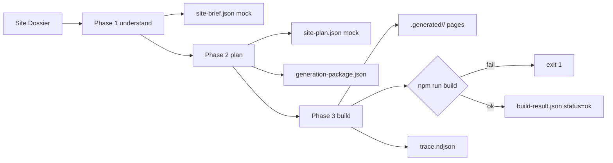

# Builder MVP

Deterministisk minimal byggare som binder ihop kedjan Starter + Scaffold + Variant + Site Dossier till en körbar Next.js-sajt. Detta är förstå-/plan-/build-flödet utan LLM-anrop, utan reparation och utan kvalitetsgate.

## Vad den gör

Givet en [Site Dossier](../../examples/painter-palma.site-dossier.json) producerar [scripts/build_site.py](../../scripts/build_site.py):

1. En körbar Next.js-app under `.generated/<siteId>/` (gitignorerad dev-output).
2. Sex kanoniska Engine Run-artefakter under `data/runs/<runId>/` (gitignorerade men strukturellt sanning).
3. En append-only `trace.ndjson` med Engine Events från alla tre faser.

Den nya kedjan i sin enklaste form:



## Kommandon

Bygga ett exempel från workspace-roten:

```powershell
python scripts/build_site.py --dossier examples/painter-palma.site-dossier.json
```

Snabb iteration utan att starta npm:

```powershell
python scripts/build_site.py --dossier examples/painter-palma.site-dossier.json --skip-build
```

Manuell preview när buildern är klar:

```powershell
cd .generated/painter-palma
npm run dev
```

## Senaste verifierade körning

```text
runId: 20260507T130917Z-painter-palma
Copying marketing-base -> .generated/painter-palma
Patching package.json
Patching app/layout.tsx
Injecting variant tokens into app/globals.css
Writing pages: /, /tjanster, /om-oss, /kontakt
Running npm run build...
Generated site at .generated/painter-palma
Run artifacts at data/runs/20260507T130917Z-painter-palma

Total runtime: 7.6 s, exit: 0
```

`build-result.json`:

```json
{
  "siteId": "painter-palma",
  "scaffoldId": "local-service-business",
  "scaffoldVersion": "1.0.0",
  "variantId": "nordic-trust",
  "language": "sv",
  "engineMode": "init",
  "modelUsed": "mock",
  "briefSource": "mock-no-key",
  "routes": ["/", "/tjanster", "/om-oss", "/kontakt"],
  "npmSteps": [
    { "name": "npm run build", "ok": true, "seconds": 7.5 }
  ],
  "status": "ok",
  "runDurationMs": 7523
}
```

`trace.ndjson` har 13 Engine Events fördelade över understand (4), plan (4) och build (5).

## Engine Run-artefakter

[engine-run.v1.json](../../governance/policies/engine-run.v1.json) säger att en körning har en `runId`-mapp under `data/runs/`. Builder MVP följer det kontraktet med en delmängd av artefakterna:

| Artefakt | Skrivs av fas | Innehåll |
|----------|---------------|----------|
| `input.json` | understand | Den oförändrade inmatningen plus `runId`, `mode=init`, `dossierPath`, `detectedLanguage` |
| `site-brief.json` | understand | Mock Site Brief härledd från dossiern. `briefSource=mock-no-key`, `modelUsed=mock` |
| `site-plan.json` | plan | Vald Scaffold + Variant + routes + valda dossiers + BuildSpec |
| `generation-package.json` | plan | Sammanfattning av vad codegen-LLM skulle få (utan att vi anropar någon) |
| `build-result.json` | build | Slutstatus, npm-steg, körtid, modelUsed=mock |
| `trace.ndjson` | alla | Append-only Engine Events |

`generated-files/`, `repair-result.json` och `quality-result.json` produceras inte än. Generated files speglas till `.generated/<siteId>/` för dev-preview.

## Builder-guards

Buildern har sex hårda spärrar:

1. Buildern skriver aldrig `.env` eller `.env.<scope>`-filer. Försök ger `AssertionError`. `.env.example` är tillåten.
2. `node_modules` och `.next` exkluderas från `copy_starter` och bevaras vid regeneration.
3. Required routes från `routes.json` måste existera som `app/<route>/page.tsx`. Saknas en route exit:ar buildern med kod 1 innan npm.
4. `npm install` körs bara om `node_modules` saknas. Failar steget skrivs `build-result.json` med `status=failed` och buildern exit:ar 1.
5. `npm run build` körs alltid när `--skip-build` inte är satt. Failar build skrivs `status=failed` och builder exit:ar 1.
6. `.generated/<siteId>/` är gitignorerad. `data/runs/` är också gitignorerad så lokala körningar förorenar inte git-status.

## Begränsningar i denna runda

Det här gör Builder MVP **inte** i denna runda. Operatören får utöka när nästa milstolpe är låst.

- Ingen LLM-fix - allt är mock eller deterministisk patch.
- Ingen Repair Pipeline.
- Ingen Quality Gate.
- Ingen Stripe, Supabase, Clerk, Shopify eller annan Integration Dossier.
- Ingen preview-release och inget `Promoted Site`-läge.
- Bara en kombination: starter `marketing-base` + scaffold `local-service-business` + variant `nordic-trust` + dossier `painter-palma`.
- Ingen follow-up - buildern kör alltid `engineMode=init`. Project DNA läses inte än.

## Filer att läsa när du orienterar dig

- [scripts/build_site.py](../../scripts/build_site.py)
- [examples/painter-palma.site-dossier.json](../../examples/painter-palma.site-dossier.json)
- [packages/generation/orchestration/scaffolds/local-service-business/](../../packages/generation/orchestration/scaffolds/local-service-business/)
- [governance/policies/engine-run.v1.json](../../governance/policies/engine-run.v1.json)
- [governance/policies/scaffold-contract.v1.json](../../governance/policies/scaffold-contract.v1.json)
- [docs/architecture/pipeline-mapping.md](pipeline-mapping.md)
