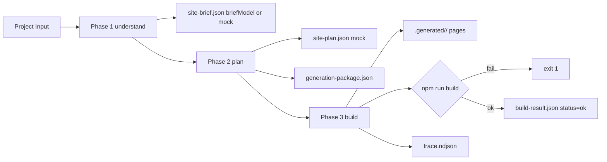

# Builder MVP

Deterministisk byggare som binder ihop kedjan Project Input + Starter + Scaffold + Variant till en körbar Next.js-sajt. Sedan Sprint 2A anropar fas 1 riktiga `briefModel` när `OPENAI_API_KEY` finns och faller annars tillbaka till en deterministisk mock. Fas 2 och 3 är fortfarande deterministiska stubs - ingen riktig planering, ingen riktig codegen, ingen Repair Pipeline, ingen Quality Gate.

## Vad den gör

Givet ett [Project Input](../../examples/painter-palma.project-input.json) producerar [scripts/build_site.py](../../scripts/build_site.py):

1. En körbar Next.js-app under `.generated/<siteId>/` (gitignorerad dev-output).
2. De kanoniska Engine Run-artefakterna under `data/runs/<runId>/` (gitignorerade men strukturellt sanning).
3. En append-only `trace.ndjson` med Engine Events från alla tre faser.

Den nya kedjan i sin enklaste form:



Site Brief-fältet `briefSource` säger om utdatan kom från riktig LLM eller fallback: `real`, `mock-no-key`, eller `mock-llm-error`.

## Kommandon

Bygga ett exempel från workspace-roten:

```powershell
python scripts/build_site.py --dossier examples/painter-palma.project-input.json
```

Snabb iteration utan att starta npm:

```powershell
python scripts/build_site.py --dossier examples/painter-palma.project-input.json --skip-build
```

Notera: argumentet heter fortfarande `--dossier` av bakåtkompatibilitet. Det
pekar på en Project Input-fil. Argumentnamnet kan döpas om i nästa
hardening-runda om det bedöms vara värt risken.

Manuell preview när buildern är klar:

```powershell
cd .generated/painter-palma
npm run dev
```

## Senaste verifierade körning

```text
runId: 20260507T130917Z-painter-palma
Copying marketing-base -> .generated/painter-palma
Patching package.json
Patching app/layout.tsx
Injecting variant tokens into app/globals.css
Writing pages: /, /tjanster, /om-oss, /kontakt
Running npm run build...
Generated site at .generated/painter-palma
Run artifacts at data/runs/20260507T130917Z-painter-palma

Total runtime: 7.6 s, exit: 0
```

`build-result.json`:

```json
{
  "siteId": "painter-palma",
  "scaffoldId": "local-service-business",
  "scaffoldVersion": "1.0.0",
  "variantId": "nordic-trust",
  "language": "sv",
  "engineMode": "init",
  "modelUsed": "mock",
  "briefSource": "mock-no-key",
  "routes": ["/", "/tjanster", "/om-oss", "/kontakt"],
  "npmSteps": [
    { "name": "npm run build", "ok": true, "seconds": 7.5 }
  ],
  "status": "ok",
  "runDurationMs": 7523
}
```

`trace.ndjson` har 13 Engine Events fördelade över understand (4), plan (4) och build (5).

## Engine Run-artefakter

[engine-run.v1.json](../../governance/policies/engine-run.v1.json) säger att en körning har en `runId`-mapp under `data/runs/`. Builder MVP följer det kontraktet med en delmängd av artefakterna:

| Artefakt | Skrivs av fas | Innehåll |
|----------|---------------|----------|
| `input.json` | understand | Den oförändrade inmatningen plus `runId`, `mode=init`, `dossierPath` (Project Input-path), `detectedLanguage` |
| `site-brief.json` | understand | Site Brief från `briefModel` när `OPENAI_API_KEY` är satt (`briefSource=real`, `modelUsed=gpt-5.4`), annars mock med `briefSource=mock-no-key` eller `briefSource=mock-llm-error` om LLM-anropet failade |
| `site-plan.json` | plan | Vald Scaffold + Variant + routes + valda dossiers + BuildSpec (deterministisk stub - planningModel kopplas i Sprint 2B) |
| `generation-package.json` | plan | Sammanfattning av vad codegen-LLM skulle få (utan att vi anropar någon) |
| `generated-files/` | build | Snapshot av filerna under `.generated/<siteId>/` exklusive `node_modules` och `.next` |
| `repair-result.json` | build | `status=not-run` skeleton tills Repair Pipeline byggs i Sprint 3 |
| `quality-result.json` | build | `status=not-run` skeleton tills Quality Gate byggs i Sprint 3 |
| `build-result.json` | build | Slutstatus, npm-steg, körtid, `modelUsed`, `briefSource`, `modelUsage`-stub |
| `trace.ndjson` | alla | Append-only Engine Events |

Generated files speglas till `.generated/<siteId>/` för dev-preview.

## Builder-guards

Buildern har sex hårda spärrar:

1. Buildern skriver aldrig `.env` eller `.env.<scope>`-filer. Försök ger `AssertionError`. `.env.example` är tillåten.
2. `node_modules` och `.next` exkluderas från `copy_starter` och bevaras vid regeneration.
3. Required routes från `routes.json` måste existera som `app/<route>/page.tsx`. Saknas en route exit:ar buildern med kod 1 innan npm.
4. `npm install` körs bara om `node_modules` saknas. Failar steget skrivs `build-result.json` med `status=failed` och buildern exit:ar 1.
5. `npm run build` körs alltid när `--skip-build` inte är satt. Failar build skrivs `status=failed` och builder exit:ar 1.
6. `.generated/<siteId>/` är gitignorerad. `data/runs/` är också gitignorerad så lokala körningar förorenar inte git-status.

## Begränsningar i denna runda

Det här gör Builder MVP **inte** efter Sprint 2A. Operatören får utöka när nästa milstolpe är låst.

- Fas 2 (`planningModel`) är fortfarande mock - scaffold/variant/dossiers väljs deterministiskt utan LLM. Sprint 2B kopplar in det.
- Fas 3 är deterministisk patch på `marketing-base` - ingen `codegenModel`, ingen Repair Pipeline (`packages/generation/repair/`), ingen Quality Gate (`packages/generation/quality-gate/`). Sprint 3 levererar dessa.
- Ingen Stripe, Supabase, Clerk, Shopify eller annan `hard` Dossier.
- Ingen preview-release och inget `Promoted Site`-läge.
- Bara en starter (`marketing-base`) och en scaffold (`local-service-business`) implementerade. Project Inputs som finns att bygga: `painter-palma`, `arcade-hall`, `foto-ram`.
- Ingen follow-up - buildern kör alltid `engineMode=init`. Project DNA läses inte än.

## Filer att läsa när du orienterar dig

- [scripts/build_site.py](../../scripts/build_site.py)
- [examples/painter-palma.project-input.json](../../examples/painter-palma.project-input.json)
- [packages/generation/orchestration/scaffolds/local-service-business/](../../packages/generation/orchestration/scaffolds/local-service-business/)
- [governance/policies/engine-run.v1.json](../../governance/policies/engine-run.v1.json)
- [governance/policies/scaffold-contract.v1.json](../../governance/policies/scaffold-contract.v1.json)
- [docs/architecture/pipeline-mapping.md](pipeline-mapping.md)
