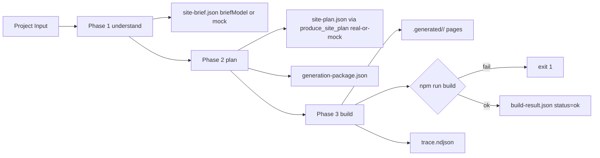

# Builder MVP

Deterministisk byggare som binder ihop kedjan Project Input + Starter + Scaffold + Variant till en körbar Next.js-sajt. Sedan Sprint 2B anropar fas 1 riktiga `briefModel` och fas 2 `planningModel` (via `packages/generation/planning/produce_site_plan`) när `OPENAI_API_KEY` finns, med mock fallback för båda. Sedan Sprint 3A (ADR 0015) producerar fas 3 deterministisk `codegenModel v1`-manifest (`packages/generation/codegen/`), riktiga Quality Gate-checks (`packages/generation/quality_gate/`) och no-fix-applied Repair Pipeline (`packages/generation/repair/`). Real `codegenModel`-LLM-anrop, mekaniska fixes (Fix Registry) och LLM-fix kommer i Sprint 3B+; Quality Gate-scoring mot Page Quality Traits kommer i Sprint 3C.

## Vad den gör

Givet ett [Project Input](../../examples/painter-palma.project-input.json) producerar [scripts/build_site.py](../../scripts/build_site.py):

1. En körbar Next.js-app under `.generated/<siteId>/` (gitignorerad dev-output).
2. De kanoniska Engine Run-artefakterna under `data/runs/<runId>/` (gitignorerade men strukturellt sanning).
3. En append-only `trace.ndjson` med Engine Events från alla tre faser.

Den nya kedjan i sin enklaste form:



Site Brief-fältet `briefSource` säger om utdatan kom från riktig LLM eller fallback: `real`, `mock-no-key`, eller `mock-llm-error`.

## Phase 3 ordering (Sprint 3B v1.1)

Inuti Phase 3 körs stegen i denna ordning. Sprint 3B v1.1 ändrade
ordningen på snapshot för att fånga post-repair-tillstånd (ADR 0016
Bug A); resten är samma som Sprint 3A.

```text
1. Copy starter -> target/
2. Patch starter (package.json, layout.tsx, globals.css)
3. Mount Dossier components (write to target/components/)
4. Write pages (write to target/app/<route>/page.tsx)
5. npm install + npm run build  (skipped when --skip-build)
6. codegen.manifest.emitted     (trace event; no disk change)
7. Quality Gate (initial)       (4 checks; reads target/)
8. Repair Pipeline              (sandwich loop; may mutate target/)
   - dispatch mechanical fixes
   - if any success -> re-run Quality Gate
   - cap at 3 sandwich passes / no-progress guard
9. Quality Gate (final)         (re-run when iterations > 0; ms-cheap)
10. Snapshot generated-files/   (POST-repair so snapshot captures fixes)
11. write build-result.json     (status reflects post-repair gate)
```

Sprint 3B v1.1-kontrakt:

- `quality-result.json` reflekterar **post-repair** Quality Gate
  (steg 9). Pre-repair status finns på
  `repair-result.json:qualityStatusBefore`.
- `data/runs/<runId>/generated-files/` reflekterar **post-repair**
  filer (steg 10) - tidigare snapshot-pre-repair gjorde att en lyckad
  fix inte syntes i Backoffice.
- `build-result.json:status` reflekterar **post-repair** aggregat:
  `ok` / `degraded` / `failed` / `skipped`.

### Vad Quality Gate kontrollerar och var

| Check | Implementation | Kontrollerar |
|---|---|---|
| `typecheck` | `packages/generation/quality_gate/checks.py:run_typecheck_check` | `npx tsc --noEmit` mot `target_dir` (skippad utan `node_modules`) |
| `route-scan` | `packages/generation/quality_gate/checks.py:run_route_scan_check` | Required routes har `page.tsx` med `export default` |
| `build-status` | `packages/generation/quality_gate/checks.py:run_build_status_check` | Aggregerar `npm install` + `npm run build` resultat (läser, kör inte om) |
| `policy-compliance` | `packages/generation/quality_gate/checks.py:run_policy_compliance_check` | Inga förbjudna `.env*`-filer under `target_dir` |

### Vad Repair Pipeline gör och var

| Steg | Implementation | Kontrollerar / muterar |
|---|---|---|
| Dispatch | `packages/generation/repair/repair.py:_dispatch_mechanical_fixes` | Iterar `MECHANICAL_FIXES` i prioritetsordning |
| `ensure-default-export` | `packages/generation/repair/fixes/ensure_default_export.py` | Adresserar route-scan-findings tagged `(saknar export default)`. Heuristic: prefer `Page` > exact-one-candidate > skip. Append-only mutation. |
| Sandwich-loop | `packages/generation/repair/repair.py:run_repair_pipeline` | Bound av `fix-registry.v1.json:loopLimits.maxTotalSandwichPasses=3` + no-progress-guard |
| Phase-3 orchestration | `packages/generation/repair/orchestration.py:execute_phase3_quality_and_repair` | Single sandwich-anropsplats per `fix-registry`-policy |

## Kommandon

Bygga ett exempel från workspace-roten:

```powershell
python scripts/build_site.py --dossier examples/painter-palma.project-input.json
```

Snabb iteration utan att starta npm:

```powershell
python scripts/build_site.py --dossier examples/painter-palma.project-input.json --skip-build
```

Notera: argumentet heter fortfarande `--dossier` av bakåtkompatibilitet. Det
pekar på en Project Input-fil. Argumentnamnet kan döpas om i nästa
hardening-runda om det bedöms vara värt risken.

Manuell preview när buildern är klar:

```powershell
cd .generated/painter-palma
npm run dev
```

## Senaste verifierade körning

```text
runId: 20260507T130917Z-painter-palma
Copying marketing-base -> .generated/painter-palma
Patching package.json
Patching app/layout.tsx
Injecting variant tokens into app/globals.css
Writing pages: /, /tjanster, /om-oss, /kontakt
Running npm run build...
Generated site at .generated/painter-palma
Run artifacts at data/runs/20260507T130917Z-painter-palma

Total runtime: 7.6 s, exit: 0
```

`build-result.json`:

```json
{
  "siteId": "painter-palma",
  "scaffoldId": "local-service-business",
  "scaffoldVersion": "1.0.0",
  "variantId": "nordic-trust",
  "language": "sv",
  "engineMode": "init",
  "modelUsed": "mock",
  "briefSource": "mock-no-key",
  "routes": ["/", "/tjanster", "/om-oss", "/kontakt"],
  "npmSteps": [
    { "name": "npm run build", "ok": true, "seconds": 7.5 }
  ],
  "status": "ok",
  "runDurationMs": 7523
}
```

`trace.ndjson` har nu fler än 13 Engine Events: Sprint 2B lade till plan-händelser (`planning.calling-llm`, `planning.mock`, `planning.degraded`) i `scripts/dev_generate.py`. Exakt antal beror på code path (`real` vs `mock-*`).

## Engine Run-artefakter

[engine-run.v1.json](../../governance/policies/engine-run.v1.json) säger att en körning har en `runId`-mapp under `data/runs/`. Builder MVP följer det kontraktet med en delmängd av artefakterna:

| Artefakt | Skrivs av fas | Innehåll |
|----------|---------------|----------|
| `input.json` | understand | Den oförändrade inmatningen plus `runId`, `mode=init`, `dossierPath` (Project Input-path), `detectedLanguage` |
| `site-brief.json` | understand | Site Brief från `briefModel` när `OPENAI_API_KEY` är satt (`briefSource=real`, `modelUsed=gpt-5.4`), annars mock med `briefSource=mock-no-key` eller `briefSource=mock-llm-error` om LLM-anropet failade |
| `site-plan.json` | plan | Vald Scaffold + Variant + routes + valda dossiers + BuildSpec via `produce_site_plan` (`planSource`: `real` / `mock-no-key` / `mock-llm-error` / `pinned`) |
| `generation-package.json` | plan | Sammanfattning av vad codegen-LLM skulle få (utan att vi anropar någon) |
| `generated-files/` | build | Snapshot av filerna under `.generated/<siteId>/` exklusive `node_modules` och `.next` |
| `repair-result.json` | build | `RepairResult` från `packages/generation/repair/` (Sprint 3A): `status=not-needed` när Quality Gate är ok, annars `status=no-fix-applied` med `remainingErrors[]`. Mekaniska fixes + LLM-fix kommer i Sprint 3B+ |
| `quality-result.json` | build | `QualityResult` från `packages/generation/quality_gate/` (Sprint 3A): fyra checks (typecheck/route-scan/build-status/policy-compliance) med per-check `status` + aggregat `ok`/`degraded`/`failed`. Scoring mot Page Quality Traits kommer i Sprint 3C |
| `build-result.json` | build | Slutstatus (`ok`/`degraded`/`failed`/`skipped`), npm-steg, körtid, `modelUsed`, `briefSource`, `modelUsage`-stub, plus `codegen` (source/modelUsed/fileCount/rationale) per ADR 0015 |
| `trace.ndjson` | alla | Append-only Engine Events |

Generated files speglas till `.generated/<siteId>/` för dev-preview.

## Builder-guards

Buildern har sex hårda spärrar:

1. Buildern skriver aldrig `.env` eller `.env.<scope>`-filer. Försök ger `AssertionError`. `.env.example` är tillåten.
2. `node_modules` och `.next` exkluderas från `copy_starter` och bevaras vid regeneration.
3. Required routes-checken körs nu av Quality Gate route-scan (Sprint 3A). Saknas en route flippas `quality-result.json:status` till `failed`, `build-result.json:status` blir `failed` och builder exit:ar 1. Den gamla `assert_routes_present`-funktionen finns kvar som B8/B9-regression-utility men interrupterar inte huvud-builden längre.
4. `npm install` körs bara om `node_modules` saknas. Failar steget skrivs `build-result.json` med `status=failed` och buildern exit:ar 1.
5. `npm run build` körs alltid när `--skip-build` inte är satt. Failar build skrivs `status=failed` och builder exit:ar 1.
6. `.generated/<siteId>/` är gitignorerad. `data/runs/` är också gitignorerad så lokala körningar förorenar inte git-status.

## Begränsningar i denna runda

Det här gör Builder MVP **inte** efter Sprint 3A. Operatören får utöka när nästa milstolpe är låst.

- Fas 2 körs via `produce_site_plan`; builder-pathen är `pinned` (Project Input styr scaffold/variant), dev-driver kan köra real `planningModel` när nyckel finns.
- Fas 3 har Sprint 3A-vertikalen klar: deterministisk `codegenModel v1`-manifest (`packages/generation/codegen/`), riktiga Quality Gate-checks (`packages/generation/quality_gate/`) och no-fix-applied Repair Pipeline (`packages/generation/repair/`). Real `codegenModel`-LLM-anrop, mekaniska fixes (Fix Registry) och LLM-fix kommer i Sprint 3B+. Quality Gate-scoring mot Page Quality Traits kommer i Sprint 3C.
- Ingen Stripe, Supabase, Clerk, Shopify eller annan `hard` Dossier.
- Ingen preview-release och inget `Promoted Site`-läge.
- Bara en starter (`marketing-base`) och en scaffold (`local-service-business`) implementerade. Project Inputs som finns att bygga: `painter-palma`, `arcade-hall`, `foto-ram`.
- Ingen follow-up - buildern kör alltid `engineMode=init`. Project DNA läses inte än.

## Filer att läsa när du orienterar dig

- [scripts/build_site.py](../../scripts/build_site.py)
- [examples/painter-palma.project-input.json](../../examples/painter-palma.project-input.json)
- [packages/generation/orchestration/scaffolds/local-service-business/](../../packages/generation/orchestration/scaffolds/local-service-business/)
- [governance/policies/engine-run.v1.json](../../governance/policies/engine-run.v1.json)
- [governance/policies/scaffold-contract.v1.json](../../governance/policies/scaffold-contract.v1.json)
- [docs/architecture/pipeline-mapping.md](pipeline-mapping.md)
