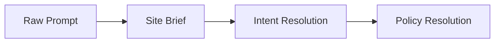
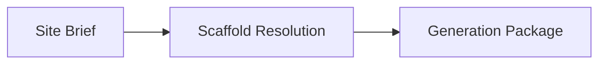
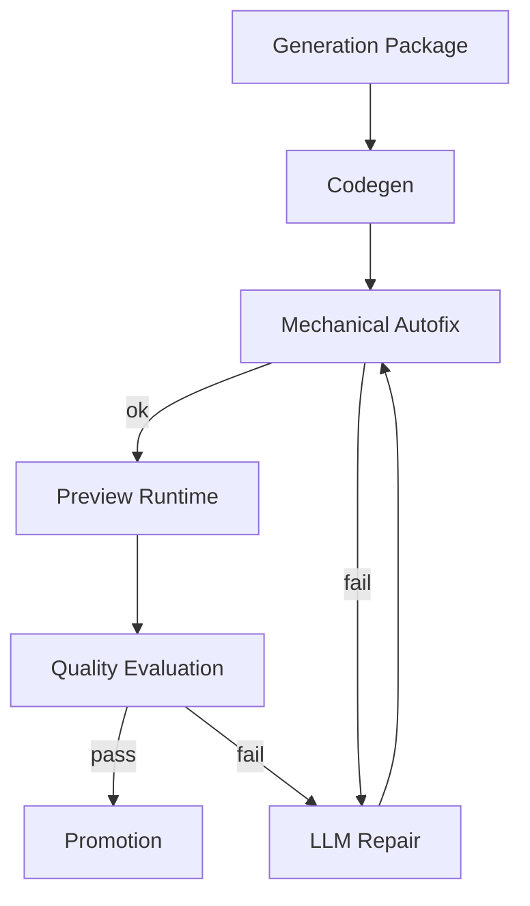

# LLM-flöde

Sanningskälla: [`llm-flow-concepts.v1.json`](../../governance/policies/llm-flow-concepts.v1.json).

## Tre faser

### Fas 1 - Brief & Policy Resolution

Tar användarens prompt och producerar en kanonisk `Site Brief` plus en `Resolved Policy`. Här ska LLM:en bara strukturera och fylla i, inte uppfinna.

| Steg | Kallar LLM? | Får inte göra |
|------|-------------|---------------|
| `raw_prompt` | nej | infer final design, choose scaffold, rewrite user intent |
| `site_brief` | ja | emit code, pick final preview runtime |
| `intent_resolution` | nej | duplicate brief schema, create new entry mode names |
| `policy_resolution` | nej | hard-code trait weights, invent quality dimensions |

### Fas 2 - Orchestration

Tar `Site Brief` + `Resolved Policy` och producerar `Generation Package` - den enda nyttolasten som får gå till codegen.

| Steg | Kallar LLM? | Får inte göra |
|------|-------------|---------------|
| `scaffold_resolution` | ja (planningModel) eller mock-fallback | route around policy, lock visual style before policy resolution |
| `generation_package` | nej | call codegen before package is complete |

### Fas 3 - Codegen, Finalize, Quality Gate

Tar `Generation Package` och producerar antingen `Promoted Site` eller `Repair Candidate`.

| Steg | Kallar LLM? | Får inte göra |
|------|-------------|---------------|
| `codegen` | ja | mutate policy, silently skip requested pages |
| `mechanical_autofix` | nej | change design intent, invent features |
| `llm_repair` | ja | full rewrite, drop high-value sections, change policy |
| `preview_runtime` | nej | own generation logic, rename runtime-specific terms |
| `quality_evaluation` | ja | promote below gate, hide blocking failures |
| `promotion` | nej | promote draft files, skip audit trail |

## Init vs Followup

De tre faserna ovan beskriver **init** (första generationen). När projektet
startade var followup medvetet utelämnat tills init var stabilt (ADR
[`0004`](../../governance/decisions/0004-migration-from-sajtmaskin-baseline.md));
det är **inte längre läget**. Followup (följdprompt → ny version) är idag ett
**centralt** flöde och kärnan i produktloopen `prompt → företagshemsida →
preview → följdprompt → ny version`.

Followup går genom Viewser `POST /api/prompt`, som klassar meddelandet och kör
sanktionerade mutationer på Project Input innan en ny build:

- **copyDirectives** — riktade copy-ändringar (t.ex. byt namn/tagline, inkludera
  token) via en dedikerad `copyDirectiveModel`-roll (ADR 0034).
- **theme_directives / visual_style** — färg/font-restyle (`brand`/`tone`).
- **section_add** — montering av nio sanktionerade sektionstyper (mount-only
  idag: `applied=true`, men synlig render + exakt placering återstår; statusen
  bärs av `appliedVisibleEffect` i `build-result.json`).

OpenClaw-conductorn är bryggan ovanpå denna in-repo-motor (in-process registry-
runtime först; extern Docker/Gateway är en senare fas). Allt followup-arbete
respekterar samma flöde och guards som init — inga sekundära vägar förbi flödet.

## Anti-patterns

- Inga sekundära init-vägar förbi flödet ovan.
- Inga "magiska" prompts som lägger till kvalitetskrav utanför `page-quality-traits.v1.json`.
- Inget `Generation Package` som muteras efter att det skickats till codegen.
- Ingen tier-uppdelad quality gate. EN gate, eller nästa policy-version.
