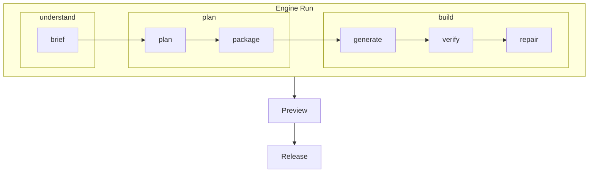

# Pipeline mapping

Sajtbyggaren har **en** generation-vokabulär: `understand` -> `plan` -> `build`, registrerad i [engine-run.v1.json](../../governance/policies/engine-run.v1.json) och [llm-flow-concepts.v1.json](../../governance/policies/llm-flow-concepts.v1.json). Det är repots kontrakt och får inte konkurrera med någon annan top-level lista.

Reviewer-konversationen i [referens/utlatanden/utlatande-2-llm-flode.txt](../../referens/utlatanden/utlatande-2-llm-flode.txt) använder en mer detaljerad intern karta (`brief` -> `plan` -> `package` -> `generate` -> `verify` -> `repair` -> `preview` -> `release`). Det är en **läs-modell**, inte en parallell pipeline. Det här dokumentet låser hur de hänger ihop så att inget av begreppen smyger in som en konkurrerande topp-fas.

## Mappning från intern karta till Engine Run

| Engine Run-fas | Intern delmoment | Skrivs när |
|----------------|------------------|------------|
| `understand` | `brief` | `input.json` + `site-brief.json` |
| `plan` | `plan` | `site-plan.json` |
| `plan` | `package` | `generation-package.json` |
| `build` | `generate` | filer under `.generated/<siteId>/` + `codegenModel v1`-manifest in-memory (Sprint 3A; ADR 0015) |
| `build` | `verify` | Quality Gate-checks (typecheck/route-scan/build-status/policy-compliance) som skrivs till `quality-result.json` (Sprint 3A) |
| `build` | `repair` | Repair Pipeline med `not-needed`/`no-fix-applied`-status som skrivs till `repair-result.json` (Sprint 3A; mekaniska fixes från Sprint 3B) |
| efter Engine Run | `preview` | Preview Runtime tar över |
| efter Engine Run | `release` | Promotion när preview är godkänd |

## Tre regler för att hålla mappningen ren

1. Ingen kod, dokumentation eller policy får införa en parallell topp-fas-lista som ersätter `understand` / `plan` / `build`. Reviewer-vokabulären får bara nämnas som **interna delmoment** av en av dessa tre.
2. `preview` och `release` är **efter** Engine Run, inte extra build-faser. Preview Runtime ägs av [packages/preview-runtime/](../../packages/preview-runtime/); promotion ägs av [packages/builder/](../../packages/builder/) (när det implementeras).
3. Ingen 12-fas-modell. `llm-flow-concepts.v1.json` listar 12 fas-id:n men de är **detaljnoteringar** inom de tre blocken `understand` / `plan` / `build`. Operatörens UI och backoffice-vyer får gruppera fritt så länge listan inte börjar leva som ny topplista.

## Var varje delmoment bor i kod

| Delmoment | Path |
|-----------|------|
| `brief` | [packages/generation/brief/](../../packages/generation/brief/) (briefModel + structured site-brief schema) |
| `plan` + `package` | [packages/generation/planning/](../../packages/generation/planning/) (Sprint 2B: `produce_site_plan` är canonical) |
| `generate` | [packages/generation/codegen/](../../packages/generation/codegen/) (Sprint 3A: `codegenModel v1`-manifest, deterministisk; LLM från Sprint 3B). Filer skrivs fortfarande av `scripts/build_site.py` tills B13/`packages/generation/build/`-flytten görs. |
| `verify` | [packages/generation/quality_gate/](../../packages/generation/quality_gate/) (Sprint 3A: typecheck + route-scan + build-status + policy-compliance) |
| `repair` | [packages/generation/repair/](../../packages/generation/repair/) (Sprint 3A: kontrakt klart; mekaniska fixes från Sprint 3B) |
| `preview` | [packages/preview-runtime/](../../packages/preview-runtime/) |
| `release` | [packages/builder/](../../packages/builder/) (kommer) |

## Vad som inte ska göras

- Inte byta `Quality Gate` mot `verify` som top-level term i naming-dictionary i denna runda.
- Inte byta `promotion` mot `release` som top-level term i denna runda.
- Inte byta `Scaffold Variant` mot bara `Variant` i denna runda.
- Inte införa nya parallella faser. `understand` / `plan` / `build` är canonical. Reviewer-vokabulären (`brief`/`plan`/`package`/`generate`/`verify`/`repair`) är delmoment, inte topplista. Den fullständiga listan över namn som globalt förbjuds (gamla sajtmaskin-ord) ligger i [`naming-dictionary.v1.json`](../../governance/policies/naming-dictionary.v1.json) under fältet `globallyForbidden`. Den listan upprätthålls automatiskt av `tests/test_no_legacy_terms.py` som blockerar varje commit som återinför någon av dem. Vill någon utöka eller krympa listan krävs ADR + naming-dictionary-bumpning.

Dessa byten kan göras senare via egen ADR. Tills dess är reviewer-vokabulären en intern läs-karta för att förklara delar, inte ett namn på något i kodbasen.

## Kopplade dokument

- [docs/architecture/builder-mvp.md](builder-mvp.md) - vad MVP faktiskt gör.
- [docs/glossary.md](../glossary.md) - mänsklig översikt av alla termer.
- [governance/policies/engine-run.v1.json](../../governance/policies/engine-run.v1.json) - sanningskälla för fas-/artefaktkontraktet.
- [governance/policies/llm-flow-concepts.v1.json](../../governance/policies/llm-flow-concepts.v1.json) - 12 fas-id:n i tre block.
