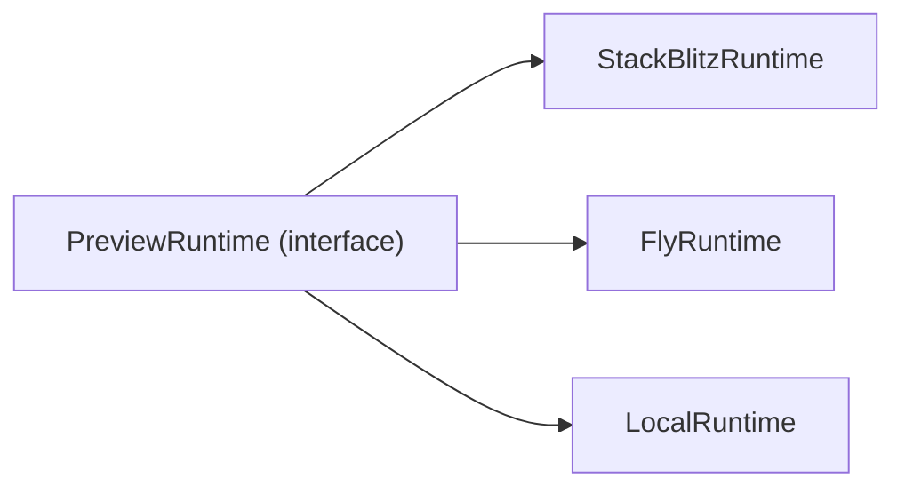

# Preview Runtime

Sanningskälla: [`preview-runtime-policy.v1.json`](../../governance/policies/preview-runtime-policy.v1.json). Interface skissas i `packages/preview-runtime/` när den fasen börjar (utkast i kommentarerna nedan).

## Princip

Produktkoden (`packages/generation`, `packages/builder`, `apps/`) talar bara om `Preview Runtime`. Förbjudna alias och tier-termer listas explicit i [`naming-dictionary.v1.json:globallyForbidden`](../../governance/policies/naming-dictionary.v1.json) och får aldrig återinföras.

## Implementationer

| Implementation | Status | Använd när |
|----------------|--------|-----------|
| `StackBlitzRuntime` | primary | iteration på Next.js-sajt utan tunga server-integrationer; default i dev |
| `FlyRuntime` | secondary | sajten kräver riktig build (Stripe, DB, eller andra `hard`-Dossier-SDK:er); produktnära smoke-test |
| `LocalRuntime` | developer-only | felsökning på utvecklarmaskin, ingen användarvänd preview |

## Quality Gate

EN gate, fyra checks: `typecheck`, `build`, `route-scan`, `preview-smoke`.

- Hoppas en check över måste det loggas som `degraded` i version-meta.
- En `Promoted Site` får inte komma från en runtime som inte kunnat köra alla gate-checks.
- Lager läggs ovanpå **bara** om eval-batchen visar att det behövs. Då skapas en ny policy-version.

## Anti-patterns från sajtmaskin

Det vi inte tar med - exakta förbjudna termer står i [`naming-dictionary.v1.json:globallyForbidden`](../../governance/policies/naming-dictionary.v1.json) och i `previewRuntime:aliasesForbidden`:

- Tier-uppdelad quality gate (`designPreview` vs `integrationsBuild`). Vi har EN gate.
- Runtime-specifika namn (`vercelSandbox`, m.fl.) som läcker in i produktterminologin.
- Runtime-specifik kod inne i `packages/generation/`. Det stannar i `packages/preview-runtime/`.

## Implementation: WebContainer / StackBlitz

`StackBlitzRuntime` bygger på `@webcontainer/api`. Implementationsdetaljer (boot/mount/spawn/server-ready, COOP/COEP-headers, vanliga fel) ligger i [`docs/integrations/webcontainers-notes.md`](../integrations/webcontainers-notes.md). Bredare extern research om SDK-/Codeflow-/Teams-/MCP-ytan, kommersiell licens och browser-baseline lever i [`docs/integrations/stackblitz-research.md`](../integrations/stackblitz-research.md). Original-konversationen som underlag finns i [`referens/preview-runtime/konversation.txt`](../../referens/preview-runtime/konversation.txt).

Sammanfattat:

- `WebContainer.boot()` görs en gång per sida och cachas (`window.__webcontainerBoot`).
- Sajtbyggarens host-frontend måste skicka `Cross-Origin-Embedder-Policy: require-corp` och `Cross-Origin-Opener-Policy: same-origin`.
- `server-ready`-eventet ger preview-URL för iframe.
- När StackBlitz inte räcker (`hard`-Dossier-SDK:er, riktiga env-värden, tunga builds) växlar vi till `FlyRuntime` via `preview-runtime-policy.v1.json:default` eller per session.
