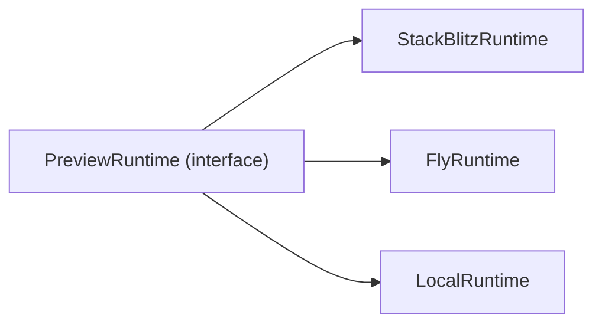

# Preview Runtime

Sanningskälla: [`preview-runtime-policy.v1.json`](../../governance/policies/preview-runtime-policy.v1.json). Interface skissas i `packages/preview-runtime/` när den fasen börjar (utkast i kommentarerna nedan).

## Princip

Produktkoden (`packages/generation`, `packages/builder`, `apps/`) talar bara om `Preview Runtime`. Förbjudna alias och tier-termer listas explicit i [`naming-dictionary.v1.json:globallyForbidden`](../../governance/policies/naming-dictionary.v1.json) och får aldrig återinföras.

## Implementationer

| Implementation | Status | Använd när |
|----------------|--------|-----------|
| `StackBlitzRuntime` | primary | iteration på Next.js-sajt utan tunga server-integrationer; default i dev |
| `FlyRuntime` | secondary | sajten kräver riktig build (Stripe, DB, eller andra `hard`-Dossier-SDK:er); produktnära smoke-test |
| `LocalRuntime` | developer-only | felsökning på utvecklarmaskin, ingen användarvänd preview |

## Quality Gate

EN gate, fyra checks: `typecheck`, `build`, `route-scan`, `preview-smoke`.

- Hoppas en check över måste det loggas som `degraded` i version-meta.
- En `Promoted Site` får inte komma från en runtime som inte kunnat köra alla gate-checks.
- Lager läggs ovanpå **bara** om eval-batchen visar att det behövs. Då skapas en ny policy-version.

## Anti-patterns från sajtmaskin

Det vi inte tar med - exakta förbjudna termer står i [`naming-dictionary.v1.json:globallyForbidden`](../../governance/policies/naming-dictionary.v1.json) och i `previewRuntime:aliasesForbidden`:

- Tier-uppdelad quality gate (`designPreview` vs `integrationsBuild`). Vi har EN gate.
- Runtime-specifika namn som ersätter canonical termen `Preview Runtime`.
  Det är OK att diskutera implementationstyper i prosa (t.ex. "Vercel Sandbox"
  eller "VM-adapter"), men kod-/policyytor ska fortsatt använda canonical
  runtime-termer och tydlig adapter-kind.
- Runtime-specifik kod inne i `packages/generation/`. Det stannar i `packages/preview-runtime/`.

## Implementation: WebContainer / StackBlitz

`StackBlitzRuntime` bygger på `@webcontainer/api`. Implementationsdetaljer (boot/mount/spawn/server-ready, COOP/COEP-headers, vanliga fel) ligger i [`docs/integrations/webcontainers-notes.md`](../integrations/webcontainers-notes.md). Bredare extern research om SDK-/Codeflow-/Teams-/MCP-ytan, kommersiell licens och browser-baseline lever i [`docs/integrations/stackblitz-research.md`](../integrations/stackblitz-research.md). Det ursprungliga underlaget låg i `referens/preview-runtime/konversation.txt` (borttaget i referens-städningen, finns kvar i git-historiken).

Sammanfattat:

- `WebContainer.boot()` görs en gång per sida och cachas (`window.__webcontainerBoot`).
- Sajtbyggarens host-frontend måste skicka cross-origin-isolation-headers så embeddet kan boota WebContainer:
  - **Embed-fallet (det vi gör i dag i `apps/viewser`):** `Cross-Origin-Embedder-Policy: credentialless` + `Cross-Origin-Opener-Policy: same-origin`. `credentialless` används istället för `require-corp` eftersom vi inte kan styra `Cross-Origin-Resource-Policy` på StackBlitz iframe-resurser. Implementerat i `apps/viewser/next.config.ts` och källkods-låst via `tests/test_viewser_isolation_headers.py`.
  - **Egen-WebContainer-fallet (framtida väg utan iframe):** `Cross-Origin-Embedder-Policy: require-corp` + `Cross-Origin-Opener-Policy: same-origin`. Detaljerat resonemang i [`docs/integrations/webcontainers-notes.md`](../integrations/webcontainers-notes.md).
- `server-ready`-eventet ger preview-URL för iframe.
- Embedded WebContainer-projekt stöds officiellt bara i Chromium-baserade browsers (Chrome, Edge, Brave, Vivaldi). Firefox/Safari rendrar "Unable to run Embedded Project" även om host-headers är rätt — operatörens dev-flöde måste alltså köras i en Chromium-browser.
- När StackBlitz inte räcker (`hard`-Dossier-SDK:er, riktiga env-värden, tunga builds) växlar vi till `FlyRuntime` via `preview-runtime-policy.v1.json:default` eller per session.
