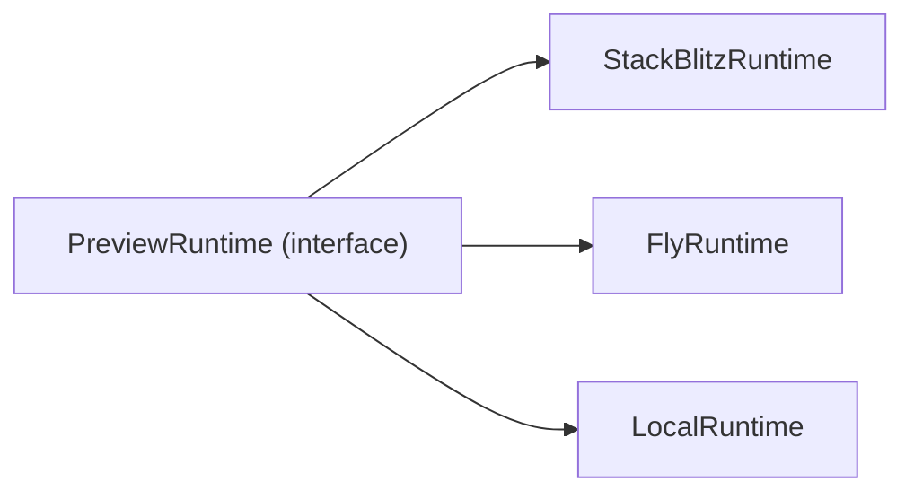

# Preview Runtime

Sanningskälla: [`preview-runtime-policy.v1.json`](../../governance/policies/preview-runtime-policy.v1.json) + interface i [`referens/starter-skiss/PreviewRuntime.ts`](../../referens/starter-skiss/PreviewRuntime.ts) (flyttas till `packages/preview-runtime/` när den fasen börjar).

## Princip

Produktkoden (`packages/generation`, `packages/builder`, `apps/`) talar bara om `Preview Runtime`. Aldrig om `VM`, `sandbox`, `preview-host`, `webcontainer` eller `tier1/2/3`. Dessa termer är `globallyForbidden` och `forbiddenTerms`.

## Implementationer

| Implementation | Status | Använd när |
|----------------|--------|-----------|
| `StackBlitzRuntime` | primary | iteration på Next.js-sajt utan tunga server-integrationer; default i dev |
| `FlyRuntime` | secondary | sajten kräver riktig build (Stripe, DB, tier-3 SDK:er); produktnära smoke-test |
| `LocalRuntime` | developer-only | felsökning på utvecklarmaskin, ingen användarvänd preview |

## Quality Gate

EN gate, fyra checks: `typecheck`, `build`, `route-scan`, `preview-smoke`.

- Hoppas en check över måste det loggas som `degraded` i version-meta.
- En `Promoted Site` får inte komma från en runtime som inte kunnat köra alla gate-checks.
- Lager läggs ovanpå **bara** om eval-batchen visar att det behövs. Då skapas en ny policy-version.

## Anti-patterns från sajtmaskin

Det vi inte tar med:

- F2/F3-tier-uppdelningen (`designPreview`, `integrationsBuild`).
- `preview_host` som produktterm.
- `vercelSandbox` som alias för `Preview Runtime`.
- Att lägga runtime-specifik kod i `packages/generation/`.

## Implementation: WebContainer / StackBlitz

`StackBlitzRuntime` bygger på `@webcontainer/api`. Implementationsdetaljer (boot/mount/spawn/server-ready, COOP/COEP-headers, vanliga fel) ligger i [`docs/integrations/webcontainers-notes.md`](../integrations/webcontainers-notes.md). Original-konversationen som underlag finns i [`referens/preview-runtime/konversation.txt`](../../referens/preview-runtime/konversation.txt).

Sammanfattat:

- `WebContainer.boot()` görs en gång per sida och cachas (`window.__webcontainerBoot`).
- Sajtbyggarens host-frontend måste skicka `Cross-Origin-Embedder-Policy: require-corp` och `Cross-Origin-Opener-Policy: same-origin`.
- `server-ready`-eventet ger preview-URL för iframe.
- När StackBlitz inte räcker (tier-3 SDK:er, riktiga env-värden, tunga builds) växlar vi till `FlyRuntime` via `preview-runtime-policy.v1.json:default` eller per session.
