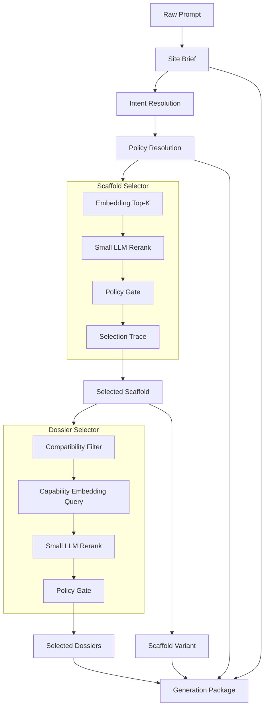

# Scaffold-/Dossier-modell

Sanningskälla:

- [`scaffold-contract.v1.json`](../../governance/policies/scaffold-contract.v1.json)
- [`dossier-contract.v1.json`](../../governance/policies/dossier-contract.v1.json)
- [`scaffold-selection.v1.json`](../../governance/policies/scaffold-selection.v1.json)
- [`dossier-selection.v1.json`](../../governance/policies/dossier-selection.v1.json)

## Begreppen

| Term | Vad det är | Inte |
|------|------------|------|
| **Scaffold** | Sajtens grammatik (route-struktur, sektionsgrammatik, kvalitetsregler, tillåtna Dossiers). | Inte en mall, inte en starter, inte en boilerplate. |
| **Scaffold Variant** | Visuellt uttryck inom en Scaffold (typografi, färg, motif). | Inte en theme i Tailwind-mening. Inte en skin. |
| **Dossier** | Återanvändbar capability-modul. Klass: soft / hard (ADR 0012 tog bort `hybrid`). | Inte en komponent. Inte en plugin. |
| **Selection Profile** | Embedding- och LLM-input som styr Scaffold Selector. | Inte en if-else word matcher. |
| **Quality Contract** | Per-Scaffold-justering av page-quality-traits (vikter, must-pass, avoid). | Inte en separat scorecard. |
| **Compatibility Filter** | Hård filtrering av Dossier-kandidater mot Selected Scaffold. | Inte en "embedding score". |
| **Selection Trace** | Strukturerad logg över val (kandidater, scores, accept/reject). | Inte fritext-loggar. |
| **Reference Template** | Externt material (Vercel) som inspiration. | Inte produktens skelett. |

## Init-flöde end-to-end



## Scaffold-katalog (14 primära)

Definierad i [`scaffold-contract.v1.json:primaryScaffoldRegistry`](../../governance/policies/scaffold-contract.v1.json):

| Id | Passar för |
|----|-----------|
| `local-service-business` | Elektriker, rörmokare, städ, takläggare, låssmed, flyttfirma |
| `professional-services` | Advokat, redovisning, B2B-konsult, rekrytering |
| `restaurant-hospitality` | Restaurang, café, hotell, catering |
| `clinic-healthcare` | Tandläkare, vårdklinik, fysioterapi, psykolog |
| `real-estate` | Mäklare, fastighetsbolag, property management |
| `agency-studio` | Designbyrå, webbyrå, brandingstudio |
| `consultant-expert` | Enskild expert, coach, rådgivare |
| `saas-product` | SaaS, AI-verktyg, produktplattformar |
| `ecommerce-lite` | Småbutik, premiumvarumärke utan tung commerce |
| `course-education` | Utbildning, kurs, mentorprogram |
| `nonprofit-community` | Förening, initiativ, kampanj |
| `portfolio-creator` | Fotograf, konstnär, kreatör, frilansare |
| `event-campaign` | Event, festival, konferens, lansering |
| `app-landing` | Mobilapp, webbapp, waitlist, beta |

## Per Scaffold (filer)

```text
packages/generation/orchestration/scaffolds/<scaffoldId>/
  scaffold.json              # id, version, label, buildIntent, defaultPageCount
  routes.json                # default + optional routes med syfte
  sections.json              # required + optional sections per route + ordningsregler
  quality-contract.json      # scorecardWeights, mustPass, avoid
  compatible-dossiers.json   # required, recommended, conditional, disallowedByDefault
  selection-profile.json     # embeddingText, semanticSignals, negativeSignals
  variants/
    <variantId>.json         # visuell variant
  examples/
    <example>.example.json   # exempelpromptar och förväntat resultat
  eval-prompts.json          # regression-prompts (länkas av tests/evals)
```

## Per Dossier (filer)

```text
packages/generation/orchestration/dossiers/<class>/<dossierId>/
  dossier.json               # id, class, label, purpose, activation, affects, promptContract
  prompt.md                  # promptfragment som injiceras i Generation Package
  code-contract.json         # must / avoid för genererad kod
  examples.md                # konkreta scaffold-specifika realiseringar
  env-contract.json          # (hard) requires, designModeBehavior, integrationModeBehavior
  integration-contract.json  # (hard) extern API + auth-flöde
  evals.json                 # (hard) regression-tester
```

## Word matching som svag signal

Word matching är **inte** primär selector. Den får leva som:

- **hård användarsignal**: "utan bokningsformulär" -> blockera `booking-request` Dossier.
- **compliance-vakter**: "läkare", "juridisk rådgivning" -> aktivera safety-policy.
- **debug**: visas i Selection Trace som motivering i klartext.
- **fallback**: när embedding/LLM misslyckas.

Ingen Scaffold får väljas direkt på grund av ett ord. Det stoppas av `mayDirectlySelectScaffold: false` i [`scaffold-selection.v1.json`](../../governance/policies/scaffold-selection.v1.json).

## Test som skydd

Regression-tester i [`tests/evals/scaffold-selection/`](../../tests/evals/) tvingar systemet att skilja prompts som har samma ord men olika intention:

- `Skapa en hemsida för en elektriker i Malmö` -> `local-service-business`
- `Skapa en SaaS för elektriker som hanterar bokningar och fakturor` -> `saas-product`
- `Skapa en restauranghemsida med meny och bordsbokning` -> `restaurant-hospitality`
- `Skapa en app landing page för ett bokningssystem för restauranger` -> `saas-product`

Det är dessa skarpa par som gör att ordmatchning inte räcker.
