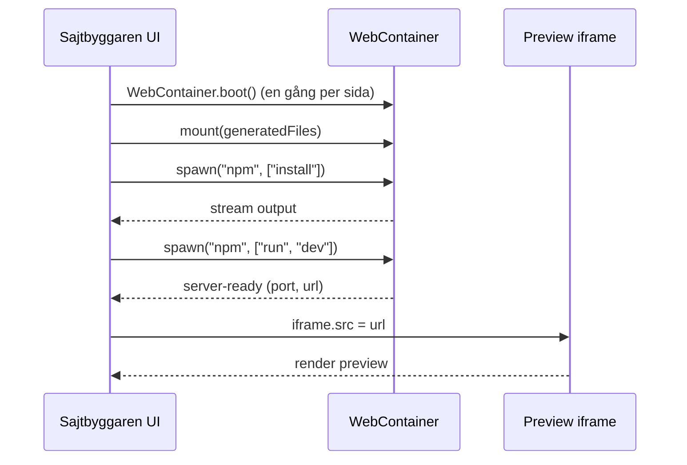

# WebContainers / StackBlitz - implementationsnoteringar

Underlag för att bygga `StackBlitzRuntime` när `packages/preview-runtime/stackblitz/` skapas. Originalkonversation finns i [`referens/preview-runtime/konversation.txt`](../../referens/preview-runtime/konversation.txt).

> Detta är **noteringar**, inte produktkod. Implementationen sker i `packages/preview-runtime/stackblitz/` och styrs av [`preview-runtime-policy.v1.json`](../../governance/policies/preview-runtime-policy.v1.json).

## Vad WebContainer är

En Node.js-runtime som körs **i browserfliken** (`@webcontainer/api`). Tillåter:

- virtuellt filsystem (laddas via `mount(filesObject)`),
- processer (`spawn("npm", ["install"])`, `spawn("npm", ["run", "dev"])`),
- preview-URL (`server-ready`-event ger port + URL för iframe).

Det är så `StackBlitzRuntime` kommer kunna köra genererade Next.js-sajter utan att backenden behöver provisionera VM:er.

## Krav på host-miljö (Sajtbyggarens egen frontend när den finns)

WebContainer kräver `SharedArrayBuffer`, vilket kräver dessa headers på host-sidan:

```
Cross-Origin-Embedder-Policy: require-corp
Cross-Origin-Opener-Policy: same-origin
```

För Vite (om vi använder det):

```js
import { defineConfig } from 'vite';

export default defineConfig({
  server: {
    port: 3000,
    strictPort: true,
    headers: {
      'Cross-Origin-Embedder-Policy': 'require-corp',
      'Cross-Origin-Opener-Policy': 'same-origin',
    },
  },
});
```

För Next.js skrivs motsvarande i `next.config.ts:async headers()`.

## Lifecycle (en runtime-session)



Viktigt:

- `WebContainer.boot()` får bara köras **en gång per sida**. Cachea i `window.__webcontainerBoot ??= WebContainer.boot()`.
- `server-ready` ger en URL som ska sättas på iframens `src`.
- Stäng inte boot:en mellan körningar; återanvänd containern och `mount` om filerna.

## Hur detta passar in i `PreviewRuntime`

Interface (utkast i [`struktur/PreviewRuntime.ts`](../../struktur/PreviewRuntime.ts), flyttas till `packages/preview-runtime/`):

```ts
export interface PreviewRuntime {
  readonly kind: PreviewRuntimeKind;
  start(files: PreviewFile[], config: PreviewRuntimeConfig): Promise<PreviewSession>;
  stop(sessionId: string): Promise<void>;
}
```

`StackBlitzRuntime` implementerar:

- `start()` -> `boot` (om ej redan), `mount`, `spawn install`, `spawn dev`, returnera `{ id, url, kind: "stackblitz", createdAt }`.
- `stop()` -> `kill` på dev-processen.

## Begränsningar (varför `FlyRuntime` finns kvar)

- Vissa Node-API:er saknas i WebContainer (filsystem-edge cases, vissa native modules).
- Långa byggen (Next.js production `build`) kan vara långsammare än lokal Node.
- Tier-3 SDK:er som kräver riktiga env-värden kan inte testas på riktigt här.

För dessa fall: `FlyRuntime`. Bytet sker via `preview-runtime-policy.v1.json:default` eller per session via runtime-config.

## Vanliga fel

| Fel | Orsak | Fix |
|-----|-------|-----|
| `SharedArrayBuffer is not defined` | COOP/COEP saknas | sätt headers på Sajtbyggarens host |
| Boot körs två gånger | HMR eller dubbelklick | cachea i `window.__webcontainerBoot` |
| Tom iframe | install eller dev failade | läs terminalpanelen |
| `localhost:3000` upptaget | annan app kör | byt port eller stäng den andra |
| Externa assets strular | COEP blockerar | använd lokala assets eller `credentialless` |

## Nästa steg när vi börjar implementera

1. Skapa `packages/preview-runtime/PreviewRuntime.ts` (flytta från `struktur/`).
2. Skapa `packages/preview-runtime/stackblitz/StackBlitzRuntime.ts`.
3. Skriv `quality-gate`-checks som kör i StackBlitzRuntime: `typecheck`, `build`, `route-scan`, `preview-smoke`.
4. Lägg till regression-tester under `tests/evals/preview-runtime/`.
5. Backoffice får en sektion "Preview Runtime status" som visar default-runtime och eventuella degraderingar.
