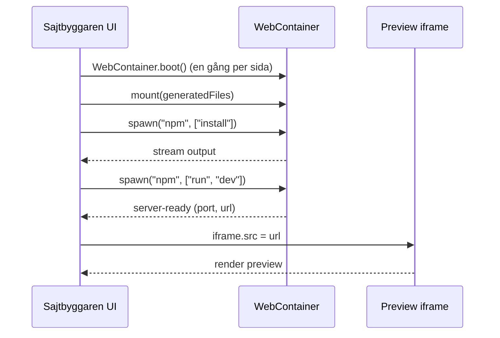

# WebContainers / StackBlitz - implementationsnoteringar

Underlag för att bygga `StackBlitzRuntime` när `packages/preview-runtime/stackblitz/` skapas. Originalkonversation finns i [`referens/preview-runtime/konversation.txt`](../../referens/preview-runtime/konversation.txt).

> Detta är **noteringar**, inte produktkod. Implementationen sker i `packages/preview-runtime/stackblitz/` och styrs av [`preview-runtime-policy.v1.json`](../../governance/policies/preview-runtime-policy.v1.json).

Bredare extern research (SDK vs `WebContainer API`, Codeflow, Teams, MCP-läget, kommersiell licens, browser-stöd) ligger i [`stackblitz-research.md`](stackblitz-research.md). Den här filen håller sig till själva implementationsmekaniken.

## Vad WebContainer är

En Node.js-runtime som körs **i browserfliken** (`@webcontainer/api`). Tillåter:

- virtuellt filsystem (laddas via `mount(filesObject)`),
- processer (`spawn("npm", ["install"])`, `spawn("npm", ["run", "dev"])`),
- preview-URL (`server-ready`-event ger port + URL för iframe).

Det är så `StackBlitzRuntime` kommer kunna köra genererade Next.js-sajter utan att backenden behöver provisionera VM:er.

## Krav på host-miljö (Sajtbyggarens egen frontend när den finns)

WebContainer kräver `SharedArrayBuffer`, vilket kräver att host-sidan är **cross-origin isolated**. Vilken `Cross-Origin-Embedder-Policy`-värde som är rätt beror på vad du gör:

| Use case | Embedder-policy | Varför |
|----------|-----------------|--------|
| Sajtbyggaren embeddar `stackblitz.com` via `sdk.embedProject(...)` (det vi gör i dag i `apps/viewser/components/viewer-panel.tsx`) | `credentialless` | Vi kan inte styra `Cross-Origin-Resource-Policy` på StackBlitz egna iframe-resurser. `require-corp` skulle blockera dem. `credentialless` är den nyare cross-origin-isolation-modellen som tillåter just det här fallet. |
| Sajtbyggaren bootar `WebContainer.boot()` direkt i sin egen sida (framtida `StackBlitzRuntime`-väg utan iframe) | `require-corp` | Vi serverar alla resurser själva och kan tagga dem med `Cross-Origin-Resource-Policy: same-origin`. Striktare och säkrare. |

För det vi gör i dag (embed via SDK) krävs **två saker**, inte en:

**(1) Host-page COEP/COOP** — Next.js-konfigen ska sätta:

```http
Cross-Origin-Embedder-Policy: credentialless
Cross-Origin-Opener-Policy: same-origin
```

Implementerat i `apps/viewser/next.config.ts:async headers()` (källkods-låst via `tests/test_viewser_isolation_headers.py`).

**(2) `credentialless` HTML-attribut på själva `<iframe>`-elementet** — när host har `COEP: credentialless` säger Chrome att varje embedded iframe måste **antingen** själv skicka en COEP-header **eller** bära `credentialless`-attributet. StackBlitz embed-respons (`stackblitz.com/run?embed=1&...`) skickar **ingen** COEP-header, så vi måste välja attribut-vägen. Implementerat i `apps/viewser/components/viewer-panel.tsx` genom att tillfälligt patcha `document.createElement` runt `sdk.embedProject(...)` så SDK:ns interna `<iframe>` får `setAttribute("credentialless", "")` **innan** den infogas i DOM — browsern börjar fetcha iframe:ns src så fort den kommer in i dokumentet, så attributet måste finnas redan då. Patchen är scopead via try/finally så vi muterar aldrig globala API:t längre än SDK:ns iframe-skapande kräver. Källkods-låst via `tests/test_viewser_isolation_headers.py::test_viewer_panel_patches_create_element_for_credentialless_iframe` plus två relaterade locks. Bakgrund: [Chrome blog: iframe credentialless](https://developer.chrome.com/blog/iframe-credentialless).

Glöm inte (2) om du av någon anledning byter ut `embedProject(...)`-anropet eller skriver om hur `ViewerPanel` skapar iframen — det är inte uppenbart att host-headers ensamt inte räcker, och Chrome-felet du då ser i DevTools är "Specify a Cross-Origin Embedder Policy to prevent this frame from being blocked", inte StackBlitz egna "Unable to run Embedded Project".

Caveat: `credentialless` (både headern och iframe-attributet) stöds bara av Chromium-baserade browsers (Chrome 96+ för headern, Chrome 110+ för iframe-attributet, Edge, Brave, Vivaldi). StackBlitz egen browser-support-tabell säger att embedded WebContainer-projekt inte stöds officiellt utanför Chromium oavsett konfig — Firefox/Safari rendrar samma "Unable to run Embedded Project" även om vi gör allt rätt på server-sidan.

Om vi i framtiden serverar en egen WebContainer-app (utan iframe-embed) byter vi till `require-corp` och taggar våra egna assets med `Cross-Origin-Resource-Policy: same-origin`. För Vite skulle det då se ut så här:

```js
import { defineConfig } from 'vite';

export default defineConfig({
  server: {
    port: 3000,
    strictPort: true,
    headers: {
      'Cross-Origin-Embedder-Policy': 'require-corp',
      'Cross-Origin-Opener-Policy': 'same-origin',
    },
  },
});
```

För Next.js skrivs motsvarande i `next.config.ts:async headers()`.

## Lifecycle (en runtime-session)



Viktigt:

- `WebContainer.boot()` får bara köras **en gång per sida**. Cachea i `window.__webcontainerBoot ??= WebContainer.boot()`.
- `server-ready` ger en URL som ska sättas på iframens `src`.
- Stäng inte boot:en mellan körningar; återanvänd containern och `mount` om filerna.

## Hur detta passar in i `PreviewRuntime`

Interface (definierat i [`packages/preview-runtime/src/types.ts`](../../packages/preview-runtime/src/types.ts) sedan Bite A `bb6ab2e`):

```ts
export interface PreviewRuntime {
  readonly kind: PreviewRuntimeKind;
  start(files: PreviewFile[], config: PreviewRuntimeConfig): Promise<PreviewSession>;
  stop(sessionId: string): Promise<void>;
}
```

`StackBlitzRuntime` implementerar:

- `start()` -> `boot` (om ej redan), `mount`, `spawn install`, `spawn dev`, returnera `{ id, url, kind: "stackblitz", createdAt }`.
- `stop()` -> `kill` på dev-processen.

## Begränsningar (varför `FlyRuntime` finns kvar)

- Vissa Node-API:er saknas i WebContainer (filsystem-edge cases, vissa native modules).
- Långa byggen (Next.js production `build`) kan vara långsammare än lokal Node.
- Tier-3 SDK:er som kräver riktiga env-värden kan inte testas på riktigt här.

För dessa fall: `FlyRuntime`. Bytet sker via `preview-runtime-policy.v1.json:default` eller per session via runtime-config.

## Vanliga fel

| Fel | Orsak | Fix |
|-----|-------|-----|
| `SharedArrayBuffer is not defined` | COOP/COEP saknas | sätt headers på Sajtbyggarens host |
| "Unable to run Embedded Project — Looks like this project is being embedded without proper isolation headers" | Samma som ovan, men sett från embed-sidan: host-sidan är inte cross-origin isolated | sätt `Cross-Origin-Embedder-Policy: credentialless` + `Cross-Origin-Opener-Policy: same-origin` i `apps/viewser/next.config.ts` (krävs även när man bara embeddar stackblitz.com) |
| "Specify a Cross-Origin Embedder Policy to prevent this frame from being blocked" i Chrome DevTools Issues-panel, embed laddar inte | Host har korrekt COEP men `<iframe>`-elementet saknar `credentialless`-attributet, och StackBlitz embed-respons skickar ingen egen COEP-header | patcha `document.createElement` runt `sdk.embedProject(...)` så iframen får `setAttribute("credentialless", "")` innan insertion (se `apps/viewser/components/viewer-panel.tsx`) |
| Boot körs två gånger | HMR eller dubbelklick | cachea i `window.__webcontainerBoot` |
| Tom iframe | install eller dev failade | läs terminalpanelen |
| `localhost:3000` upptaget | annan app kör | byt port eller stäng den andra |
| Externa assets strular | COEP blockerar | använd lokala assets eller `credentialless` |
| Embedded preview funkar i Chrome men inte Firefox/Safari | StackBlitz stöder embedding av WebContainer-projekt officiellt bara i Chromium-browsers | använd Chrome/Edge/Brave/Vivaldi för operatörens dev-flöde |

## Nästa steg när vi börjar implementera

1. Skapa `packages/preview-runtime/PreviewRuntime.ts` (flytta från `struktur/`).
2. Skapa `packages/preview-runtime/stackblitz/StackBlitzRuntime.ts`.
3. Skriv `quality_gate`-checks som kör i StackBlitzRuntime: `typecheck`, `build`, `route-scan`, `preview-smoke`.
4. Lägg till regression-tester under `tests/evals/preview-runtime/`.
5. Backoffice får en sektion "Preview Runtime status" som visar default-runtime och eventuella degraderingar.
